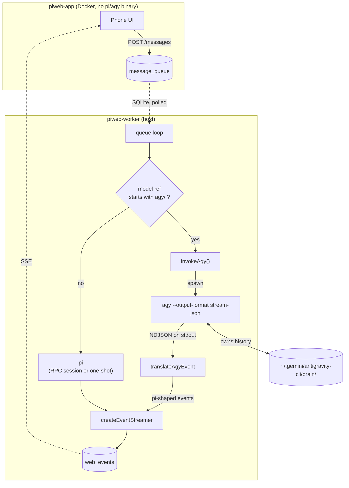
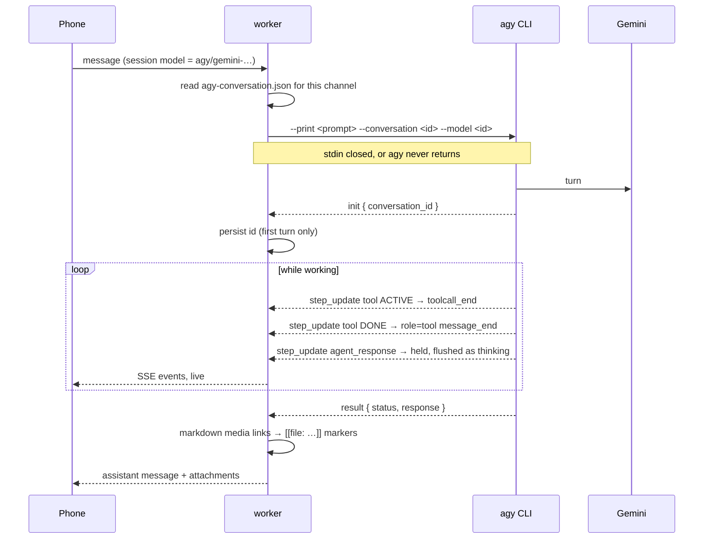

# CLAUDE.md — piweb

Guidance for working in this repo. piweb is a **mobile web front end for the pi
coding agent**, forked from [piscord](https://github.com/Crokily/pi-discord-gateway):
the agent core is kept as-is and the Discord transport was replaced with a web one.

Read the "Invariants" section before changing anything — most of the entries there
exist because breaking them produced a confusing half-failure rather than an
obvious error.

---

## 1. Project design

### The split, and why it exists

```
  iPhone ──HTTPS──▶  piweb web  (Docker, NO pi binary)
                          │
                          │  SQLite (WAL): web_events / control_queue /
                          │               message_queue / channels / meta
                          ▼
                     piweb worker (HOST, systemd --user)  ──spawns──▶  pi
```

The worker runs **on the host, not in the container**, deliberately. pi is only
useful here if it keeps host access: `systemctl --user`, docker, the ROCm GPU,
and the project checkouts under `~/src`. Containerising pi would silently reduce
it to a sandboxed code editor. The web tier therefore has no pi binary and never
spawns one; the two halves communicate **only** through SQLite.

Both halves ship from one codebase (`dist/cli/piweb.js`):

| mode     | runs                                    | used for                        |
| -------- | --------------------------------------- | ------------------------------- |
| `worker` | message loop + control loop + scheduler | host systemd unit               |
| `web`    | HTTP/SSE server                         | container                       |
| `all`    | both in one process                     | dev, or an all-in-one container |

`WEB_EMBEDDED_WORKER=true` makes `web` also run the worker.

### Layout

Inherited from piscord (avoid editing unless the change is transport-agnostic):

```
src/agent/       pi core: invoke.ts (spawns pi), queue.ts (message loop),
                 rpc-session.ts, model-catalog.ts, channel-settings.ts, scheduler.ts
src/session/     path.ts (session dirs + rotation), media.ts (attachment staging),
                 archive-cleanup.ts, model-info.ts (reads pi's model_change)
src/discord/     the ORIGINAL transport — unused by piweb but still compiled;
                 attachments.ts's AttachmentMeta is reused (local-file variant)
src/db.ts        schema + queries; piweb tables + helpers at the bottom
```

piweb's own code:

```
src/transport/   index.ts  = Transport interface + setTransport/getTransport
                 web.ts    = the web transport: agent output → web_events (+ media)
src/commands/    catalog.ts = COMMANDS, pure data, safe for the web tier to import
                 extension-runner.ts = discovery & runner for Pi extension slash commands (WORKER-only)
                 index.ts   = runCommand() implementations (WORKER-only; pulls in pi deps)
src/web/         server.ts = node:http router (no framework): API + SSE + static
                 auth.ts   = token cookie, Tailscale identity, CSRF, login throttle
                 push.ts   = Web Push sender (tails web_events → APNs/FCM)
src/worker/      index.ts  = worker startup (loops + model-catalog + trash sweep)
                 control.ts = control_queue drain loop
src/media-path.ts  ONE spelling of a media dir/URL (invariant 9)
src/cli/piweb.ts   entrypoint: worker | web | all
public/          index.html, app.css, app.js — no framework, no build step
                 markdown.js = markdown + KaTeX + Mermaid + code highlighting
                 sw.js       = service worker (Web Push receive only)
                 vendor/katex/ = KaTeX vendored locally (no CDN)
                 vendor/mermaid/ = Mermaid.js vendored locally (no CDN)
                 vendor/highlight/ = highlight.js browser build (no CDN)
                 icons/piweb/  = home-screen icon set; manifest.webmanifest
scripts/history.py  read-only history query CLI (stdlib only)
deploy/          piweb-worker.service
```

### How a turn flows

The two processes never call each other; every interaction is a row in SQLite
that the other side polls. `web_events.rowid` is the one monotonic clock the
whole UI is built on — SSE cursor, unread marks, push cursor, and paging all key
off it.

```
 phone ──POST /messages──▶ web server
                              │  append web_events(user)      ← instant echo
                              │  insert message_queue(pending)
                              ▼
                    (SQLite, WAL, shared)
                              ▲
   worker queue loop ─claimNextMessage─┘  (per-channel serial, global cap 3)
        │ spawn pi --session-dir <dir> --continue --mode json
        │ stream stdout events ─▶ getTransport().createEventStreamer(jid)
        │                          └─▶ append web_events(thinking/tool/tool_result)
        │ setChannelBusy(jid,true) … clearTyping on finish
        ▼ final reply → parseOutboxMarkers → append web_events(assistant [+files])
                              │
 phone ◀──SSE /stream?after=N─┘  web tails web_events by rowid, pushes each
```

Reply text flows through the transport's `sendResponse`/`sendFilesResponse`; the
streamed thinking/tool events flow through `createEventStreamer`. Both end up as
`web_events` rows, so the transcript is complete and replayable — the phone can
disconnect at any point and resume from its last rowid.

### Why commands go through `control_queue`

The web tier _cannot_ execute them:

- `/pi status` spawns pi over RPC for token stats
- `/pi stop` needs the worker's in-memory `AbortController`
- `/pi new` must not race an in-flight run (`isChannelProcessing`)
- `/gpt-usage` reads the host's pi OAuth credentials through `src/gpt-usage.ts`
- `/kv status`, `/kv save`, `/kv restore`, `/kv prune` execute llama.cpp slot KV cache manager via host Pi RPC in `src/commands/extension-runner.ts`

So web validates against `COMMANDS` and writes an intent row; the worker executes
it and appends the result as a `system`/`error` event. Command output therefore
travels the same SSE path as chat and survives reconnects. Adding a command means
touching `src/commands/catalog.ts` (data) **and** `runCommand()` (implementation).

### Extension Runner & KV Cache Subsystem

Extension commands (e.g. `/kv status`, `/kv save`, `/kv restore`, `/kv prune`, `/kv base-update`) are routed through `src/commands/extension-runner.ts`:

```
Web Client ──POST /api/channels/:jid/command──▶ web server
                                                    │
                                                    ▼ (insert control_queue)
                                              SQLite (WAL)
                                                    ▲
                                                    │ (poll control_queue)
Worker control loop ────────────────────────────────┴──▶ runExtensionCommand()
                                                           │
                                                           ▼ (spawns transient RPC)
                                                      `pi --mode rpc`
                                                           │
                                                           ▼ (Extension API)
                                                 `pi-kv-cache-manager`
                                                           │
                                            ┌──────────────┴──────────────┐
                                            ▼                             ▼
                                   llama-server (:8001)        ~/.cache/llama-slots/
                                   (slot save / restore)       (30 slots, 40GB quota)
```

1. **Transient RPC Isolation**: Spawns an isolated `pi --mode rpc` with channel environment, executes the extension's registered slash command via the Pi Extension API, and parses the structured response.
2. **Golden Base System Prompt Cache**: Evaluates `ctx.getSystemPrompt()` hash (including all tools and `<available_skills>`); on cache hit, restores ~28.5k tokens into llama-server slot in ~50ms.
3. **LRU Quota Management**: Enforces a strict 30-session snapshot quota and 40GB storage limit on NVMe.


### The data model

Every piweb table is at the bottom of `src/db.ts`. The ones that carry state
between the two processes use an autoincrement `rowid` as a cursor.

| table                                                                     | role                                                                                                                                                                                                           | who writes                                           | who reads              |
| ------------------------------------------------------------------------- | -------------------------------------------------------------------------------------------------------------------------------------------------------------------------------------------------------------- | ---------------------------------------------------- | ---------------------- |
| `channels`                                                                | one row per session (`web:<uuid8>` jid, folder, per-session model/thinking/cwd overrides, `deleted_at`)                                                                                                        | both                                                 | both                   |
| `web_events`                                                              | the transcript AND the live stream: user turns, assistant replies, thinking, tool, tool_result, system, error                                                                                                  | worker (agent output), web (user turn, command echo) | web (SSE/paging), push |
| `message_queue`                                                           | pending user messages for the worker                                                                                                                                                                           | web                                                  | worker                 |
| `control_queue`                                                           | command intents the web tier can't run itself                                                                                                                                                                  | web                                                  | worker                 |
| `channel_state`                                                           | transient `busy` flag per session (typing/spinner)                                                                                                                                                             | worker                                               | web                    |
| `channel_operations`                                                      | generation-specific durable leases for HTTP requests, active workers, uploads, and warm persistent RPC processes; purge expires abandoned request leases but live owners heartbeat and revalidate before reuse | both                                                 | both                   |
| `session_title_jobs`                                                      | crash-safe first-prompt title job (normally `waiting` → `done` during enqueue; worker fallback uses `pending` → `processing`); the copied prompt is erased on completion/cancel                                | web                                                  | both                   |
| `session_purge_journal` / `session_purge_paths` / `session_purge_batches` | durable exact-batch claim, immutable detach manifest, and completion receipt for cross-filesystem permanent deletion; fences owner writes/deletes until tombstone cleanup and atomic DB finalization finish    | both                                                 | both                   |
| `meta`                                                                    | key/value the web tier needs but can't compute: `models` (pi's catalog), `auth.signingKey`, `push.vapid`, `push.cursor`                                                                                        | worker (models), web (auth/push)                     | web                    |
| `push_subscriptions`                                                      | one row per opted-in device                                                                                                                                                                                    | web                                                  | push                   |
| `message_log`, `scheduled_tasks`                                          | inherited from piscord; `message_log` duplicates web_events (gap)                                                                                                                                              | worker                                               | —                      |

`web_events.kind` is the discriminator the UI switches on: `message` (with
`role` user/assistant) renders a bubble; `thinking`/`tool`/`tool_result` render
collapsed event blocks; `system`/`error` render open. Only
`message(assistant)`/`system`/`error` count as "a reply" for unread and push —
never the user's own turns or the streamed chatter.

### The HTTP API

All under `src/web/server.ts`, one flat router. Everything except login/logout/
me and the static shell requires auth; state-changing methods also pass the CSRF
origin check.

| route                                       | method        | purpose                                                                                                                                                                                                                          |
| ------------------------------------------- | ------------- | -------------------------------------------------------------------------------------------------------------------------------------------------------------------------------------------------------------------------------- |
| `/api/login` `/logout` `/me`                | POST/POST/GET | token→cookie; `/me` also reports `via` (token/tailscale) and `funnel`                                                                                                                                                            |
| `/api/push/key` `/subscribe` `/unsubscribe` | GET/POST/POST | VAPID public key; save/drop a subscription                                                                                                                                                                                       |
| `/api/commands`                             | GET           | the `COMMANDS` catalog for autocomplete                                                                                                                                                                                          |
| `/api/models`                               | GET           | pi's model list (from `meta`, published by the worker)                                                                                                                                                                           |
| `/api/life-session`                         | POST          | idempotently create/restore the singleton Life channel and clear its overrides                                                                                                                                                   |
| `/api/life-session/new`                     | POST          | promote current Life into the standard list and create a fresh empty Life singleton                                                                                                                                              |
| `/api/sessions`                             | GET/POST      | list standard live sessions (with badge, busy, `lastReplyId`); create immediately as `New session`                                                                                                                               |
| `/api/sessions/deleted`                     | GET           | the trash (must precede the `:jid` matcher)                                                                                                                                                                                      |
| `/api/sessions/deleted/purge`               | POST          | permanently purge the exact non-empty, unique, currently deleted/idle standard-session `{ jids, storageTokens, deletionTokens, deletedAts }` set after atomically matching and claiming the complete displayed deletion episodes |
| `/api/sessions/:jid`                        | PATCH/DELETE  | rename; soft-delete (or `?permanent=1`)                                                                                                                                                                                          |
| `/api/sessions/:jid/restore`                | POST          | un-trash                                                                                                                                                                                                                         |
| `/api/sessions/:jid/events`                 | GET           | `?after` (SSE catch-up) `?before` (page up) `?around` (jump) or newest page                                                                                                                                                      |
| `/api/sessions/:jid/stream`                 | GET           | SSE tail (polls web_events every 400ms)                                                                                                                                                                                          |
| `/api/sessions/:jid/search`                 | GET           | `?q=` substring search within the session                                                                                                                                                                                        |
| `/api/sessions/:jid/messages`               | POST          | text + base64 attachments → queue                                                                                                                                                                                                |
| `/api/sessions/:jid/commands`               | POST          | a `COMMANDS` name → control_queue                                                                                                                                                                                                |
| `/api/sessions/:jid/clear`                  | POST          | wipe web_events + enqueue `pi new`                                                                                                                                                                                               |
| `/media/...`                                | GET           | served attachment/output files                                                                                                                                                                                                   |

### Feature → code map

| feature                                        | where                                                                                                                                                                                                                                                                                                                                                                                           |
| ---------------------------------------------- | ----------------------------------------------------------------------------------------------------------------------------------------------------------------------------------------------------------------------------------------------------------------------------------------------------------------------------------------------------------------------------------------------- |
| markdown + LaTeX + syntax highlighting         | `public/markdown.js` (`renderRich`), KaTeX and highlight.js in `vendor/`; loose/nested lists across blank lines, `<ol start="N">` offsets, indented continuations; unlabeled/unknown fences use language auto-detection                                                                                                                                                                         |
| inline YouTube player                          | `public/markdown.js` exact-host/video-ID parsing + lazy privacy-enhanced iframe; `public/app.css` 44px play/open/close targets, 16:9 standard card, and adaptive 200px minimum in narrow user/event columns; `test/e2e/markdown-links.spec.ts` modified-click/open/replace/nested/event/close video workflow; full contract in [`docs/youtube-inline-player.md`](docs/youtube-inline-player.md) |
| Mermaid flowcharts & diagrams                  | `public/markdown.js` + `public/vendor/mermaid/` (offline vector rendering, shared Japanese palette for all chart types, readable wide Gantt canvas, diagram-type labels, pinch-to-zoom 0.2x–5x, pan, double-tap, fullscreen modal, code copy)                                                                                                                                                   |
| search + jump-to-message                       | `/search` + `/events?around=`; client `state.atLive` gates SSE while detached                                                                                                                                                                                                                                                                                                                   |
| text selection & quoting                       | `public/text-selection.js` (iOS lollipop handles, line rect filtering, floating quote toolbar)                                                                                                                                                                                                                                                                                                  |
| image lightbox (swipe + pinch zoom)            | `public/app.js` `openLightbox`, pinch-to-zoom, pan, double-tap, numbered placeholder filmstrip, sliding-window prefetch `[idx-2..idx+2]`                                                                                                                                                                                                                                                        |
| multimedia paste                               | `public/app.js` (`btn-paste` + `paste` event; images, audio, video, documents)                                                                                                                                                                                                                                                                                                                  |
| Life mode                                      | singleton `channels.kind='life'` + `/api/life-session` and `/api/life-session/new`; right-edge UI in `public/app.js`; full diagrams in [`docs/life-mode.md`](docs/life-mode.md)                                                                                                                                                                                                                 |
| thinking & tool physics                        | `public/app.js` + `public/app.css` (CSS grid `0fr->1fr` accordion, animated chevron, slide-up pop-in inertia)                                                                                                                                                                                                                                                                                   |
| Recently deleted                               | `deleted_at` soft delete; bottom sheet with Select-button/long-press multi-selection, one-confirmation batch purge, and Delete all; worker `sweepTrash` purges after `WEB_TRASH_RETENTION_DAYS`                                                                                                                                                                                                 |
| push notifications                             | `src/web/push.ts` + `public/sw.js`; VAPID + cursor in `meta`                                                                                                                                                                                                                                                                                                                                    |
| provider badges                                | `src/session/model-info.ts` `providerBadge()`; NV/LOCAL/GEM/… plus TERRA/SOL/LUNA for the Codex GPT-5.6 variants. Mirrored client-side by `providerBadgeFor()` for the model-picker rows — change both or the two views disagree                                                                                                                                                                |
| unread dot / busy spinner                      | `channel_state.busy` + `lastReplyId` vs localStorage `piweb.seen`                                                                                                                                                                                                                                                                                                                               |
| session ordering & boot default                | `src/db.ts` (`order by coalesce(last_activity, c.created_at) desc`) + `sessionsForDisplay()` in `public/app.js` (recency-first default)                                                                                                                                                                                                                                                         |
| automatic first-prompt title                   | `src/agent/session-title-ranker.ts` (in-process linear candidate ranker, original writing system, ≤10 graphemes), `src/web/server.ts` (apply on message enqueue), `src/worker/session-title.ts` (recovery fallback), `session_title_jobs` in `src/db.ts`                                                                                                                                        |
| rename / model sheet / edge-swipe drawer       | `public/app.js` (all client-side)                                                                                                                                                                                                                                                                                                                                                               |
| topbar ⋯ overflow menu & iPadOS safe clearance | `#more-menu` in `index.html`; `openMoreMenu()`/`onMenuItem()` in `app.js`; iPad topbar `padding-left: max(60px, ...)` to clear multitasking pill                                                                                                                                                                                                                                                |
| stay signed in                                 | persisted `auth.signingKey` + localStorage `piweb.token` auto-login                                                                                                                                                                                                                                                                                                                             |
| KV cache & extension commands                  | `src/commands/extension-runner.ts` (RPC command probe + run), `src/commands/catalog.ts` (`/kv status`, `/kv save`, `/kv restore`, `/kv prune`, `/kv help`), `src/commands/index.ts`, `src/web/server.ts` (`getMergedCommands()` via `meta.extension_commands`), `src/worker/index.ts` (`publishExtensionCommands()`)                                                                      |

### Context compaction is pi's, not piweb's

pi compacts on its own — `compaction` in `~/.pi/agent/settings.json`
(`enabled`, `reserveTokens`, `keepRecentTokens`). It is **not** TUI-only: piweb
runs `--mode json`, whose `print-mode.js` goes through `session.prompt()`, which
runs `_checkCompaction()` before sending and after each assistant message. Proof
it works here: a live session had 11 `{"type":"compaction"}` entries in its
JSONL. So do not "add compaction" to piweb — it already happens.

What piweb owns is _showing_ it. `--mode json` dumps **every** session event to
stdout (`session.subscribe(...)` → `JSON.stringify`), so `compaction_start` /
`compaction_end` arrive in `createEventStreamer` like any other event. Only
`compaction_end` with a `result` and `aborted === false` is surfaced, as a
`system`/`compacted` row; a start marker would just be noise, and pi emits
`compaction_end` with no `result` when it bails (no model, no auth).

`result.tokensBefore` is the size it compacted away _from_; there is no
"after" in the payload, so do not compute or imply one.

This also explains a confusing symptom: `/pi status` can read **over 100%**
(seen: `304,028 / 272,000 = 111.8%`). That is the pre-compaction peak — the
threshold is `window − reserveTokens` against the model's real window, not the
number status prints, so the figure is allowed to climb past it before pi
compacts. In that very case pi compacted two minutes later with
`tokensBefore: 304028`. It is not a bug and not a stuck session.

### Which model a badge shows

The badge must track the model the session **is set to**, so picking one in the
sheet is reflected immediately. Two sources disagree, and the precedence matters:

- **`channels.model_override`** — passed to pi as `--model` on _every_ run
  (`channel-settings.ts` → `queue.ts`), so when set it **is** the session's
  model. It **wins**.
- **pi's session file** (`model_change` lines, read by `getSessionModel()`) —
  only records what the _last run happened to use_. It goes stale the moment the
  model changes and no message has been sent yet. It is the fallback, used for
  sessions following the gateway default, where it is the only honest source.

Getting this backwards was a real bug: a session set to `gpt-5.6-sol` kept
showing TERRA until a message was sent. `pending` on the API means "chosen but
not yet exercised by a run" — compare `modelIdFromRef(override)` against the
session file's bare `modelId`.

`pi model` round-trips through `control_queue`, so the override lands some
unpredictable moment after the tap. The client polls (`awaitOverride()`) until
it matches instead of guessing a single delay.

### Reading history: paged, newest-first

The transcript is **not** loaded in full. A fresh open fetches the newest page
(`PAGE_SIZE = 50`); scrolling within 300px of the top pulls the previous page and
prepends it, Discord-style, until `hasMore` is false.

`GET /api/sessions/:jid/events` has three modes, all served by the single
`(channel_jid, rowid)` index as bounded range scans — cost tracks page size, not
transcript length:

| query          | returns               | used for                 |
| -------------- | --------------------- | ------------------------ |
| _(none)_       | newest `limit`        | first open               |
| `?before=<id>` | `limit` older than id | scroll-up paging         |
| `?after=<id>`  | newer than id         | SSE catch-up / reconnect |

`limit` is clamped to 200. Adding a filter on any non-indexed column would turn
these into table scans — don't.

**Prepending must not move the viewport.** `loadOlder()` records `scrollHeight`
and `scrollTop`, inserts the page as a single `DocumentFragment`, then sets
`scrollTop += (scrollHeight - heightBefore)`. Verified by measuring a reference
element's viewport offset across a load: it must shift by exactly the amount
scrolled and not by the height of the inserted rows (measured drift: 0px).

Careful when testing: assigning `element.scrollTop` fires a real scroll event, so
it can trigger a load during your own measurement and make two post-load states
look like a passing comparison.

### Deleting is soft

`DELETE /api/sessions/:jid` sets `channels.deleted_at` and clears only the
pending queue. The transcript, settings and pi session directory are untouched,
so `POST /:jid/restore` brings the session back exactly as it was. The trash is
listed by `GET /api/sessions/deleted` and previewed read-only (writes to a
trashed session are refused with 409).

`?permanent=1` permanently destroys one item. The trash sheet's batch endpoint,
`POST /api/sessions/deleted/purge`, accepts only an exact non-empty unique
aligned `{ jids, storageTokens, deletionTokens, deletedAts }` object (bounded by the normal 64 MiB request cap). It atomically
claims every target only while all remain deleted and idle, then fences restore,
worker, scheduler, request writes, owner-folder reuse, and channel deletion with
a durable purge journal. Before recursive deletion, each directory source's
`dev:ino` identity is persisted and revalidated after it is atomically renamed
to a batch-unique tombstone; a swapped or unrecognized directory remains
quarantined instead of being traversed. Source parents and entries are checked
with `lstat`; top-level symlinks and hard links are unlinked without traversal
or inode modification, archive-enumeration I/O errors fail closed, and the
cleaned endpoint is replaced by a path-specific authenticated regular-file seal
using `O_EXCL|O_NOFOLLOW`. Existing seals are opened read-only, verified against
the journal token, and never unlinked by a competing runner. All per-path work
settles before target completion, and source/destination parents, new seal
files, and cleaned tombstone directories are fsynced before `files_done`.
Concurrent/late recovery therefore touches only the exact recorded tombstone
payloads, never a new owner reusing the same JID/folder. Claiming uses
segment-aware canonical paths to reject nested/archive-prefixed session roots
(including dot-prefixed names such as `..nested`) and sanitized media-name
aliases owned by any other channel. The root-level `.piweb-purge` tombstone
namespace is reserved; legacy conflicts are rejected before journaling. Channel registration and Life re-key/create
run in IMMEDIATE transactions and repeat the same alias check against every
pending purge, closing the post-claim ownership race. Standard upload staging includes an immutable random channel
storage token; purge durably replaces the old operation-owner roots with
regular-file guards, so an expired request cannot recreate data after success
while an exact JID/folder reuse receives a distinct namespace. Filesystem
failures return pending rather than success and remain recoverable on startup. Warm idle
RPC children hold and heartbeat the same durable generation lease as active
requests, retain it until confirmed child exit, retire when deletion revokes it,
and revalidate before every reuse. Standard RPC sessions remain warm; Life RPC
sessions retire before delivering each completed turn so New/archive is never
blocked by an idle child. Message and command routes acquire their generation
lease before reading the request body. A durable batch receipt resolves
concurrent completion, and DB ownership for the
complete batch is removed in one transaction only after all pi session
directories, media, and uploads are durably detached and cleaned.
Delete all submits the identities currently shown to the user, never a
server-wide wildcard. The worker
sweeps the trash hourly and purges anything older than
`WEB_TRASH_RETENTION_DAYS` (30).

The responsive sheet exposes a direct **Select** button and a scroll-safe touch
or mouse long press on each row. Desktop constrains it to a centered 640 px
modal; phone layouts remain bottom-aligned. It uses native `dialog.showModal()`
for composable background isolation, Escape handling, and stacked-modal
ownership instead of mutating global `inert` flags. Monotonic trash-load tokens
prevent older GET responses from overwriting a committed purge. Selection mode
keeps native checkboxes, Select all/Clear all, a live
selected count, and one **Delete selected** confirmation; **Delete all** has its
own count-aware confirmation. Purging the session currently open as a read-only
trash preview closes the sheet and selects a live standard fallback instead of
leaving dead preview state in the composer.

This also closed the old gap where deleting a session stranded its `.jsonl` on
disk forever — now it is either restorable or genuinely purged.

### Storage: two histories, not one

| store                       | what                       | cleared by                                        |
| --------------------------- | -------------------------- | ------------------------------------------------- |
| `web_events` table          | what the UI shows          | `POST /clear` or permanent delete                 |
| `sessions/<folder>/*.jsonl` | what pi actually remembers | `/pi new` rotates it; permanent delete removes it |

The header's **Delete session** action is deliberately soft and clears neither
store; the session remains restorable under **Recently deleted**. The legacy
`POST /clear` route still clears both histories but is no longer exposed as the
header menu action. Query either with `scripts/history.py show|context`.

### Search and jump

`GET /api/sessions/:jid/search?q=` does a substring match within one session and
returns snippets cut around the hit. Clicking a result calls
`/events?around=<id>`, which returns a window centred on that event; the client
replaces the transcript with it, scrolls the target into view and flashes it.

Jumping **detaches the view from the live tail**, which is why `state.atLive`
exists: while detached, incoming SSE events must not be appended (they belong
after history the user cannot see yet). They set `hasMoreNewer` and reveal
"Jump to present" instead, and scrolling down pages forward until the tail is
reached, at which point live appends resume.

`like '%x%'` cannot use an index, so search scans that session's rows — bounded
by `(channel_jid, rowid)` to one session. Fine at personal scale; the upgrade
path is FTS5 with sync triggers, not another b-tree index (no index can serve a
leading wildcard).

### Querying history

`scripts/history.py` — stdlib only (this host has no `sqlite3` binary) and opens
the database **read-only**, so it is safe against a running worker.

```bash
./scripts/history.py sessions            # list sessions + last activity
./scripts/history.py show <name> -n 30   # transcript (web_events)
./scripts/history.py search <text>       # across all sessions
./scripts/history.py search x --kind error system
./scripts/history.py context <name>      # pi's own .jsonl (what it remembers)
./scripts/history.py stats               # row counts + disk usage
```

Sessions resolve by fuzzy name, not just jid. Note the pi session format nests a
turn under `event["message"]` and its `content` is a list of typed parts
(text / thinking / toolCall / toolResult), **not** a string.

---

## 2. Invariants (break these and it fails confusingly)

1. **`PIWEB_DATA` must be mounted at the same absolute path inside and outside
   the container.** The web tier stages uploads and records their _absolute_
   paths in SQLite; the host worker opens those exact paths. A different mount
   point (e.g. `/data`) leaves text messages working while every attachment dies
   with ENOENT.

2. **The web tier must not import `src/commands/index.ts`** (or anything else
   reaching `agent/model-catalog`). Those pull in `@earendil-works/pi-*` peer
   deps that do not exist in the container — the image dies at startup with
   `ERR_MODULE_NOT_FOUND`. Import `src/commands/catalog.ts` instead. For the same
   reason `cli/piweb.ts` imports the worker **dynamically**, only in worker modes.

3. **`WEB_HOST` stays `127.0.0.1` while `WEB_TRUST_TAILSCALE_IDENTITY` is on.**
   Identity comes from a plain HTTP header injected by `tailscale serve`; anything
   that can reach the port directly could set it itself. The sidecar shares the
   app's network namespace, so loopback is sufficient. `tailscaleIdentity()` also
   rejects non-loopback per request.

4. **Identity headers do not prevent CSRF.** serve stamps the _device's_ identity
   onto every request the browser makes, including one a hostile page triggers.
   Every state-changing request is separately checked against `WEB_PUBLIC_ORIGIN`
   via `Origin`/`Sec-Fetch-Site`. Keep that check when adding routes.

5. **New sessions auto-issue `pi new`** (silently, via `control_queue`) so a
   session can never inherit an agent context. It is a no-op for a fresh folder;
   it exists as a guarantee, and because deleted sessions currently leave their
   session directory on disk.

6. **`[hidden] { display: none !important }` must stay at the top of app.css.**
   Author rules that set `display` (`.login{display:grid}`, `.app{display:flex}`,
   `.typing`, `.autocomplete`) beat the UA stylesheet's `[hidden]` rule regardless
   of specificity. Without it the login overlay renders permanently on top of a
   fully working app — and `el.hidden` still reads `true`, so no JS check catches it.

7. **SSE is resumed by event id.** `EventSource` auto-reconnect would replay from
   the original `?after=` and duplicate everything, so the client closes and
   reopens with the current cursor. Keep `web_events.rowid` monotonic.

8. **`ts-state/` must stay in `.dockerignore`.** It is root-owned; including it
   breaks `docker build` with `can't stat ts-state/certs`.

9. **Media paths have exactly ONE spelling** — `src/media-path.ts`. The first
   cut built directories with `encodeURIComponent(jid)`, so `web:abc` became a
   directory literally named `web%3Aabc`, while the server decoded the URL back
   to `web:abc` and looked for a directory that never existed. Every generated
   image and upload 404'd into a broken-image icon with the file sitting on
   disk. Sanitising to `[A-Za-z0-9._-]` makes encoding a no-op both ways — never
   reintroduce an encode on one side and a decode on the other. Standard browser
   uploads intentionally live under generation/operation-unique `.operations`
   paths outside durable owner roots; this keeps an expired request from
   recreating or cleaning a later owner's media.

10. **Attachments use the local-file `AttachmentMeta` variant** (`filePath` set,
    `url` empty). `session/media.ts` copies instead of fetching, so uploads still
    get PNG transcoding and Breeze ASR voice transcription.

11. **The model registry must be built from an awaited `ModelRuntime`, never
    from `AuthStorage`.** pi 0.84 replaced the synchronous
    `new ModelRegistry(authStorage)` construction with an async
    `ModelRuntime.create()`. The old call still _constructs_ — it just returns a
    facade whose every method throws `this.runtime.refresh is not a function`.
    Because `listAvailableModels()` sits on the message path
    (`processMessage` → `computeEffectiveChannelSettings`), that is not a
    degraded model picker: **every message fails**, and the only symptom the user
    sees is `Internal error: this.runtime.refresh is not a function`. The worker
    stays `active (running)` throughout, so restarting fixes nothing. Prime the
    runtime once at worker startup (`primeModelRegistry()`) and keep
    `listAvailableModels()` synchronous by reading its snapshot; when it is not
    primed yet, serve the last catalog rather than throwing, so the model list can
    never take the message path down with it.

12. **pi's version is what pins piweb's behaviour — check it first.** A pi
    release can break piweb at rest, with no piweb change involved; invariant 11
    is exactly that, 0.74 → 0.84.1. When the worker breaks right after an install
    or a deploy and nothing in `git log` explains it, check the installed version
    before reading any piweb code:

```bash
npm ls @earendil-works/pi-coding-agent @earendil-works/pi-ai
```

Do **not** reach for `node -p "require('…/package.json').version"` — pi's
`exports` map has no `./package.json` entry, so that throws
`ERR_PACKAGE_PATH_NOT_EXPORTED` and looks like a broken install. See
"Pinning pi" in §3 for which version belongs there.

---

## 3. Deployment

### Configuration

Config is read from `PIDG_CONFIG` (default `~/.config/pi-discord-gateway/config.env`),
inherited from piscord. On this host the worker uses `~/.config/piweb/config.env`
and the container gets the same values from `~/src/piweb/.env` via compose.

**The two must agree** on every path variable — see invariant 1.

| variable                                             | side   | notes                                            |
| ---------------------------------------------------- | ------ | ------------------------------------------------ |
| `DB_PATH`, `SESSIONS_DIR`                            | both   | the shared state; identical paths                |
| `WEB_MEDIA_DIR`, `WEB_UPLOAD_DIR`                    | both   | uploads staged by web, read by worker            |
| `WEB_AUTH_TOKEN`                                     | both   | token login; may be empty if identity auth is on |
| `WEB_PORT`, `WEB_HOST`                               | web    | `WEB_HOST` stays loopback (invariant 3)          |
| `WEB_TRUST_TAILSCALE_IDENTITY`                       | web    | default true                                     |
| `WEB_ALLOWED_LOGINS`                                 | web    | comma-separated; empty = any tailnet identity    |
| `WEB_PUBLIC_ORIGIN`                                  | web    | CSRF origin check (invariant 4)                  |
| `WEB_SESSION_TTL_SEC`                                | web    | cookie lifetime                                  |
| `WEB_EMBEDDED_WORKER`                                | web    | run the worker in-process (all-in-one)           |
| `PI_BIN`, `PI_CWD`, `PI_MODEL`, `PI_THINKING`        | worker | pi invocation                                    |
| `STREAM_THINKING`, `STREAM_TOOLS`, `MAX_EVENT_CHARS` | worker | what gets streamed                               |
| `RPC_STEER`, `INTERRUPT_ON_NEW_MESSAGE`              | worker | mid-run steering / pre-emption                   |
| `MAX_CONCURRENCY`, `POLL_INTERVAL_MS`                | worker | queue behaviour                                  |
| `ARCHIVE_RETENTION_DAYS`                             | worker | archived session cleanup (default 30)            |
| `MAX_ATTACHMENT_BYTES`                               | both   | upload cap                                       |

`DISCORD_*`, `CHANNEL_POLICY`, `AUTO_THREAD`, `TRIGGER_NAME` etc. are inherited
from piscord and unused by the web transport.

### Pinning pi

piweb builds against pi's **internal** API (`ModelRegistry`, `ModelRuntime`,
`AuthStorage`), not a stable public surface. Those move between minor releases,
so the pi version is part of this deployment's configuration — pin it to the
version the code was actually written and verified against, and treat a bump as
a code change with testing, never as routine dependency maintenance.

Piweb uses two pi surfaces: `PI_BIN` runs the customized fork for agent turns,
while piweb imports its internal model APIs from the npm packages below. Keep the
npm packages on the customized fork's exact base version.

Currently verified: **0.84.1** (both packages kept in lockstep;
pi-coding-agent's shrinkwrap may install its own matching pi-ai copy).

```jsonc
// package.json — devDependencies AND peerDependencies must agree
"@earendil-works/pi-ai": "0.84.1",
"@earendil-works/pi-coding-agent": "0.84.1"
```

Pin **exactly**, not `^0.84.0`. pi is pre-1.0, so semver gives a caret no real
protection: the break behind invariant 11 arrived in a minor bump, and the next
one can arrive in a patch.

Before this fix, the peer deps said `"*"`, the dev deps said `^0.74.0`, and the
lockfile resolved 0.74.0 while an out-of-band install had put 0.84.1 on disk.
That made the next clean deployment reinstall the stale API. `npm ls` reported
the mismatch as `invalid`, which was easy to scroll past:

```
├── @earendil-works/pi-ai@0.84.1 invalid: "^0.74.0" from the root project
└─┬ @earendil-works/pi-coding-agent@0.84.1 invalid: "^0.74.0" from the root project
```

`invalid:` there is not noise — it is the warning that the tree no longer matches
what the code expects. When bumping pi deliberately: change both fields to the
new exact version, `npm install`, `npm run build`, then exercise a real message
end to end (`listAvailableModels()` is on the message path — a clean `tsc` proves
nothing, since the 0.84 break type-checked fine and failed only at runtime).

### Host worker

```bash
npm install && npm run build
cp deploy/piweb-worker.service ~/.config/systemd/user/
systemctl --user daemon-reload && systemctl --user enable --now piweb-worker
```

Config: `~/.config/piweb/config.env` (chmod 600). Paths **must** match the
compose `.env`.

### Web tier + Tailscale

```bash
cp .env.example .env      # PIWEB_DATA, WEB_AUTH_TOKEN, WEB_PUBLIC_ORIGIN
docker compose up -d --build
```

The sidecar registers its own tailnet node (`TS_HOSTNAME=piweb`) so the UI gets
its own subdomain, e.g. `https://piweb.<tailnet>.ts.net/`. State lives in
`./ts-state`; once authenticated no key is needed again.

**Funnel is ON** (`AllowFunnel` in ts-serve.json), so the UI is reachable from
the public internet. That was an explicit decision, and it changes the threat
model: the shared token is now the ONLY thing in front of host command
execution.

What that required:

- **Identity auth is refused on Funnel requests.** serve overwrites the
  `Tailscale-User-*` headers for tailnet traffic (verified: a forged header
  from a tailnet client still reports the real login), but a Funnel request has
  no identity to overwrite with. Rather than stake host RCE on serve stripping
  them, `tailscaleIdentity()` returns undefined whenever
  `Tailscale-Funnel-Request` is present. Public visitors must use the token.
- **`/api/login` is rate limited** (8 failures → 60s lockout) because it now
  faces the internet. Buckets are keyed on the forwarded client address, and
  that was verified to be per-client: locking out the public path leaves the
  tailnet path answering 401, so an attacker cannot lock the owner out.
- `WEB_ALLOWED_LOGINS` does **not** apply to Funnel traffic — there is no
  identity to match. It only restricts tailnet users.

**Enabling Funnel needs a tailscaled restart.** `tailscale funnel status` reports
"Funnel on" as soon as the serve config is applied, but the node does not
actually accept public traffic until it re-establishes its ingress connection.
Symptom: the public path fails TLS ("unexpected eof") while the tailnet path is
fine. `docker restart piweb-ts` fixes it. Test the public path with
`curl --resolve <host>:443:<public-A-record>` — MagicDNS otherwise routes you
over the tailnet and you never exercise Funnel at all. Use a known-working
Funnel host on the same tailnet as a control.

#### Registration gotcha

`containerboot` runs `tailscale up` with a **60-second timeout**. Interactive
login cannot finish in human time: the container is SIGTERMed, restarts, and
generates a _new_ node key, so the URL the user clicked is already stale. Symptom:
`failed to auth tailscale: tailscale up failed: signal: killed`, restart count
climbing, `tailscale serve status` → "No serve config".

Two working options:

- **auth key** in `TS_AUTHKEY` (what the other services here use), or
- **authenticate outside containerboot**: run `tailscaled` directly with the same
  state dir, `tailscale up --hostname=piweb`, let the user click at leisure,
  verify `ts-state/tailscaled.state` grew (~2.5 KB, not ~119 B), then start the
  compose sidecar, which comes up from state.

**Always redeploy with plain `docker compose up -d`, never `up -d app`.** The
sidecar is `network_mode: service:app`, so recreating `app` alone orphans its
netns and the Funnel goes dead — and the sidecar cannot even be restarted back
into it (`docker restart piweb-ts` → _"joining network namespace of container:
No such container"_). Only recreating the sidecar too fixes it. `up -d` does
that for you; targeting `app` does not. Verify after every deploy:

```bash
docker compose build app && docker compose up -d
curl -s -o /dev/null -w '%{http_code}\n' https://piweb.<tailnet>.ts.net/   # expect 200
```

Note `public/` is **COPY**ed into the image, not bind-mounted, so a frontend-only
change still needs `docker compose build app`. Static files are served
`cache-control: no-cache`, so phones pick up new JS/CSS on reload with no
cache-busting.

### Auth

Two paths; the server refuses to start with neither:

1. **Tailscale identity** — nothing to type; optionally restrict with
   `WEB_ALLOWED_LOGINS`.
2. **Shared token** (`WEB_AUTH_TOKEN`) → HttpOnly cookie; for local/dev or any
   deployment not behind serve.

---

## 4. Verification approach

The bugs in this project were mostly _invisible to the checks that looked
sufficient_. Verify accordingly.

### Look at the UI. Do not trust DOM assertions.

The worst bug here reported perfectly healthy state — `login.hidden === true`,
app populated, 14 messages rendered — while the screenshot showed the login
overlay covering everything. It was a CSS specificity problem; no amount of JS
introspection would have found it.

So: **screenshot at a phone viewport (390×844) and actually look**, for every
state — login, empty, populated, drawer open, autocomplete open, long code block.
Also assert `document.documentElement.scrollWidth === clientWidth` (the page must
never scroll sideways; wide content scrolls inside its own box).

A second class of bug survives _both_ DOM assertions and a glance at the code:
the TERRA badge rendered exactly the label it was asked to and was still
unusable, because it sat one row away from a near-identical green. Colour,
contrast and adjacency only fail in the picture — compare elements **against
their real neighbours**, in the real list, at the real size.

The deterministic Playwright visual suite stores reviewed PNG baselines under
`test/e2e/__screenshots__/` and records each run as WebM under
`artifacts/playwright/test-results/`; the HTML evidence report is
`artifacts/playwright/report/`. Inspect changed pixels before running
`npm run test:e2e:update`. Screenshots made by one-off scripts against the
live deployment may still land in `~/`; use
`find /home/chihmin -maxdepth 2 -name '<file>.png'` if one appears to vanish.

### Control both directions

A detector that only ever reports failure is worthless. When adding a check,
prove it can also say "ok":

- history-query staleness: fed it a conversation that _does_ exist → `ok`
- side-panel matching: injected a matching row → `ok (side panel row)`
- CSRF: `Origin: https://evil.example` → 403 **and** correct origin → 200
- identity forgery: from another container → connection refused **and** the
  legitimate path → `via: tailscale`

### Test the real deployment, not just localhost

Container↔host-worker integration is where the path/import assumptions break.
The useful end-to-end is: create a session through the **container**, send a
message, confirm the **host worker** ran pi and the reply came back — over the
real HTTPS URL, not `127.0.0.1`.

### Commands

```bash
npm test                      # Vitest unit/integration suite
npm run test:e2e             # Playwright mobile behavior + visual baselines + video
npm run test:e2e:update      # accept visual changes only after pixel inspection
./node_modules/.bin/tsc --noEmit
npm run build
./scripts/history.py stats    # read-only; safe against a live worker
docker compose logs -f app
journalctl --user -u piweb-worker -f
```

The local Playwright fixture server is `test/e2e/fixture-server.mjs`; it serves
production files from `public/` without auth or account state. Recently deleted
batch behavior is maintained in `test/e2e/life-mode.spec.ts` (`npx playwright
test test/e2e/life-mode.spec.ts --grep "Recently deleted|purging the active"`):
it covers the Select button, touch/mouse long press, checkbox count, selected
purge, Delete all, stale-load rejection, native/stacked modal containment,
active-preview fallback, phone containment, centered desktop layout, hit
testing, screenshots, and one recorded workflow video. Backend tests also inject
symlink roots, fsync failure, archive-enumeration failure, concurrent recovery,
and idle RPC ownership loss. Evidence lands under
`artifacts/playwright/test-results/`.

The maintained first-prompt naming workflow is
`test/e2e/session-auto-title.spec.ts` (`npx
playwright test test/e2e/session-auto-title.spec.ts`); it covers no-dialog
creation, first prompt, ≤10-character rename, polling, reload durability,
pointer reachability, viewport containment, and horizontal overflow. The title
worker uses the in-process linear candidate ranker in
`src/agent/session-title-ranker.ts`; it must never invoke pi, a model binary, a
network API, or OpenCC. It preserves the source writing system and has no model
or KV state.
Evidence
lands under `artifacts/playwright/test-results/`; update its reviewed baseline
only after pixel inspection with `--update-snapshots=all`. Tests in
`live-scroll.spec.ts` are skipped unless `PIWEB_E2E_LIVE_URL` is set, and token
login reads `PIWEB_E2E_TOKEN` — never embed a deployed URL or credential in a
test.

`test/queue-cwd.test.ts` installs a stub transport via `setTransport()` — the
queue no longer imports the Discord client, so module-mocking it does nothing.

---

## 5. UI / UX conventions

Discord-flavoured dark theme, phone first, no framework and no build step —
`public/` is served as-is.

- **iOS specifics**: `100dvh` (not `100vh`, which hides the composer when the URL
  bar collapses); `env(safe-area-inset-*)` padding; inputs at **16px** minimum
  (smaller makes iOS zoom on focus); `viewport-fit=cover`.
- **Layout**: drawer overlays below 768px and becomes a fixed sidebar above it.
  Long content (code, tool output) scrolls inside `overflow-x: auto`; the page
  body never scrolls horizontally.
- **Message rendering**: minimal markdown (fenced code, inline code, nested
  bold/italic/strike links, loose/nested lists, `<ol start="N">` numbering
  offsets, indented item continuations, blockquotes, tables) built from **text
  nodes only**. Styled inline spans recurse with a per-call regex cursor; never
  share `INLINE_RE.lastIndex` across nested parsing. Exact YouTube video URLs are
  enhanced only after safe anchor creation: validate the host and 11-character
  ID, lazy-load one `youtube-nocookie.com` iframe per message on an unmodified
  click, and retain the external link. Keep the complete URL, lifecycle, layout,
  accessibility, and test contract aligned with [`docs/youtube-inline-player.md`](docs/youtube-inline-player.md).
  Never assign model-authored HTML to `innerHTML`;
  KaTeX and highlight.js may assign only the escaped markup they generate from
  math/code source.
- **Streamed events** (thinking / tool / result) are collapsed `<details>` with a
  one-line peek; `system`/`error` open by default and omit the peek so the text
  is not shown twice.
- **The drawer is ordered by recency: newest activity first.** The key is
  `lastActivity` (`max(web_events.created_at)` for the channel), so anything that
  touches a session — your message, pi's reply, command output — moves it up,
  and a session with a new message lands on top for free
  (`activityKey()` / `sessionsForDisplay()`). Recomputed on **every** render, and
  `lastActivity` arrives fresh from the 5s `loadSessions()` poll (SSE only
  carries the _open_ session), so a reply in a background session moves it up
  while the drawer is open.
  - Those timestamps are SQLite `'YYYY-MM-DD HH:MM:SS'` UTC — fixed-width and
    zero-padded, so a **string** compare is already chronological. Do not reach
    for `Date` here; that would also need the `Z` fix (see Timestamps below).
  - A session with no events yet was only just created, so it sorts newest.
  - History: this replaced a state ranking (unread → busy → rest), which itself
    replaced a settle-on-open order. Recency subsumes the "new message on top"
    goal without the ranking's downside of rows jumping between state buckets.
- **Topbar = frequent actions; ⋯ menu = the rest.** In standard mode the topbar
  holds `/gpt-usage` and the model picker; search, `/pi new` and soft **Delete
  session** live in the ⋯ menu. The `/pi status` icon belongs to Life instead and
  appears only after its exact generation is confirmed. Life places it before
  the pencil immediately before ⋯ for **New Life session**: atomically promote
  the current transcript/Pi folder
  into the standard list, then select a fresh empty Life singleton. The menu is
  a popover anchored under the button, not a bottom
  sheet: these are quick actions and a sheet would feel as heavy as the model
  picker. Command rows name the slash command they run; Delete session instead
  names its Recently deleted destination in the confirmation. Dismissal is a
  transparent full-screen `#menu-scrim` (plus Escape) — a `document` click
  listener would fire on the opening tap itself. Rows that need a live session
  are disabled while previewing a trashed one, and the topbar's session-bound
  buttons are hidden there; Search still works.
- **Badge colours must survive being next to each other.** TERRA was first shipped
  mint green and was indistinguishable from the LOCAL/GPT greens one row away —
  the label was "correct" and the UI still failed. It is terracotta now (Sol
  amber, Luna slate). Check a new badge colour against its _neighbours in situ_,
  not on its own.
- **Timestamps**: SQLite returns `YYYY-MM-DD HH:MM:SS` in UTC with no zone marker.
  Append `Z` before parsing or Safari reads it as local time and every stamp is
  hours off.
- **The on-screen keyboard changes only the VISUAL viewport.** `vh`/`dvh` track
  the _layout_ viewport, which iOS does not shrink for the keyboard. A popover
  sized in `vh` above the composer therefore runs off the top of the screen and
  is clipped rather than scrolling. The autocomplete is a normal flex item
  (not absolutely positioned) so the column bounds it, and `--ac-max` is kept in
  sync with `window.visualViewport` by `syncAutocompleteHeight()`. Test this by
  resizing the viewport short (390×420), not just at 390×844.
- **`highlight()` must never be called with an empty needle.** `indexOf('')`
  returns the search position rather than -1, so its loop never advances — an
  infinite loop that freezes the tab. It is guarded now; the model filter hit
  this because it renders the list before anything has been typed.
- **Session indicators mean two different things.** A spinner = pi is working
  in that session right now; a green dot = it finished and you have not opened
  it since. Different shapes on purpose, so they are tellable apart without
  relying on motion or colour. Unread is tracked client-side in localStorage
  (`piweb.seen`, jid → last read reply id), because "not yet read" is per
  device. `lastReplyId` deliberately counts only assistant/system/error events,
  never the user's own turns or streamed thinking/tool chatter.
  The SSE stream carries only the OPEN session, so the drawer polls
  `/api/sessions` every 5s or every other session's state freezes at page load.
- **Edge swipes have paired meanings**: in standard mode a drag from the left
  edge opens the session drawer; in Life the same rightward back gesture exits
  to the last standard session. A drag starting within 56px of the right edge
  and moving left opens Life. The visible 48×64px water-drop leaf is also an
  accessible button; tapping it auto-settles through the same protected
  transition. Life commits after 22% or when a shorter fast flick's velocity
  projection crosses that boundary. The drop is nested inside `.main`: its
  rounded body stays within the page and its point meets the right edge, so one
  shared page transform carries both left with a velocity-scaled ease. This
  reveals the stationary Life preview underneath instead of sliding an overlay
  above the page. Post-release travel uses a balanced `cubic-bezier(0.4,0,0.2,1)`
  over 150–320ms, then keeps the destination underlay above the newly rendered
  transcript for a 180ms opacity handoff; never clear the transform and hide the
  underlay in the same frame. Start entry/exit destination navigation only after
  the source page is fully covered; otherwise a fast response can mutate the
  still-visible `.main`. If exit cancellation or the desktop breakpoint arrives
  after standard selection began, re-enter Life with a newer navigation generation
  before handoff—hiding the preview alone does not cancel that standard request.
  Both gestures track the finger, lock their axis after 8px, and abandon a vertical lock before
  calling `preventDefault`, so transcript scrolling is never stolen. Life's
  left-edge back drag follows the finger, commits after 22%, and requires the
  release direction to remain rightward; shallow drags ease home, while committed
  drags and the Sessions button settle right over a Sessions underlay before the
  same crossfade. Reversals, touchcancel, foreground menus, newer navigation, and
  desktop breakpoint changes cancel it.
  The fixed edge button is outside `.messages`' scroll ancestry, so a vertical lock that
  starts on the button explicitly forwards `dy` to the transcript; test real
  `scrollTop`, not merely the absence of a Life request. Swipe gestures are disabled
  above 768px (where the water-drop button remains available for direct click entry) and
  while a lightbox/sheet owns the foreground. **Never
  recover a drag position with `getComputedStyle`** — a style flush can return
  stale CSS during a fast event burst. Keep offsets and signed velocity in drag
  state. Post-release settlement makes the underlying main/drawer inert, owns
  pointer hit-testing, blocks drawer gestures, and exposes an overlay Cancel
  action; any newer navigation must invalidate that preview ownership immediately.
- **Life is not a managed session.** It is one protected `channels.kind='life'`
  row, omitted from standard/trash lists and restored on every idempotent entry.
  Every turn probes `PI_BIN --mode rpc --no-session` for Pi's exact runtime
  model/effective thinking, applying an explicit thinking override when set, and
  always uses `PI_CWD`. Probe completion sends SIGTERM, escalates to SIGKILL after a
  bounded grace, and waits for child exit. Channel/settings management is rejected
  server-side, with thinking level configurable through `pi thinking`; `pi stop` and
  the typed `pi new` command remain available. Life exposes the generation-bound `pi
  status` shortcut, thinking level picker, and **New Life session** as header actions;
  its ⋯ menu keeps Search and Media. The pencil button calls
  `/api/life-session/new`, which compares the caller's Life generation, refuses
  stale generations, active/queued work, or request/worker leases, re-keys the
  current row/transcript/Pi folder and scheduled tasks to a new standard JID,
  inserts a fresh empty `web:life`, and commits a media/upload move journal.
  Filesystem moves finish idempotently after commit and recover during DB startup;
  a failed completion never rolls back or deletes the new Life folder. Life
  messages/commands echo the generation captured with their draft and lease that
  exact folder across upload/commit awaits. Uploads use operation-unique paths and
  atomically commit their event/queue row only after post-I/O ownership renewal.
  The message worker heartbeats the same persisted ownership through final
  stream/typing cleanup, then releases it; a
  crashed lease expires after one hour. Every worker write is additionally fenced
  by the captured folder generation, so a suspended worker that resumes after
  expiry is aborted and cannot touch replacement-Life output, media, partial, or
  busy state. Scheduled enqueue re-resolves its current active DB owner, no-ops when its
  row was deleted, and freezes deleted or quarantined owners without consuming
  the per-tick budget or starving unrelated due work. Worker recovery fails
  interrupted messages owned by deleted sessions instead of replaying them. Events paging/jump, search, media, and
  SSE require the expected generation, so stale tabs get a conflict before
  replacement rows can mix into old chrome. Processing controls remain an
  authoritative archive blocker regardless of heartbeat age; worker startup fails
  unfinished rows rather than replaying non-idempotent commands. Owner/folder
  checks still fence asynchronous mutation points and output for both Life and
  standard sessions using both folder and immutable storage token; exact
  JID/folder reuse cannot authorize stale request leases, rename/delete/restore/
  clear mutations, or late stream/typing cleanup after a soft delete completes
  or a purge finalizes. Clear rejects trashed sessions before transcript mutation. Control claims are one atomic
  active-owner transaction, so a concurrent delete cannot strand a partially
  claimed batch. The non-authoritative UI busy mirror never gates archive without matching queue work. The lower-level
  typed `pi new` still rotates only Pi's internal context. After retiring a
  warm RPC it rechecks both the in-process active map and the SQLite processing
  queue and durable request/RPC leases inside the same IMMEDIATE transaction as
  synchronous directory rotation, so no local or cross-worker owner can run
  under a moving session path. Returning or rolling back with no
  standard session must clear the active Life JID, stream, transcript, partial,
  busy, and search ownership before showing `no session`, so the composer cannot
  submit to hidden Life state. See [`docs/life-mode.md`](docs/life-mode.md) for
  the workflow, software architecture, persistence, and race-ownership diagrams.
- **Image lightbox (Swipe, Pinch-to-zoom & Pan)**: tapping an image opens an in-app viewer (`openLightbox`)
  rather than a new tab, collecting every image in the transcript so swiping
  pages through them. The overlay sets `touch-action: none` and handles its own
  gestures: multi-touch pinch-to-zoom scales with transform matrix bounds, double-tap toggles
  2.5x zoom, horizontal swipe pages at 1x scale, and downward drag dismisses. Small images are shown at native size rather than
  upscaled — an icon blown up to fill the screen just looks blurry.
- **Apple-style Text Selection & Quoting (`public/text-selection.js`)**:
  Custom selection UI overlays iOS-style teardrop lollipop handle pins (`.sel-handle-line` + `.sel-handle-knob`)
  and a frosted glass floating action toolbar (`Quote`, `Copy`, `Dismiss`).
  - Uses `getFilteredLineRects()` to strip out container bounding boxes (such as `<ul>` or `<div>` wrapper blocks)
    that distort table/markdown highlights.
  - Character-level alignment (`getHandlePointRect`) pins the lollipops precisely to the selection endpoints.
  - The quote cancel button (`.quote-preview-remove`) has an enlarged 32x32px hit target with `stopPropagation()`
    and deliberately avoids focusing the textarea to prevent keyboard popups on mobile devices.
- **Thinking & Tool Accordion Physics (`public/app.css` & `public/app.js`)**:
  - Streamed events (thinking / tools) are encapsulated inside collapsible `<details class="event">` cards
    with left accent color bars (purple for thinking, indigo for tools, emerald for tool results).
  - Smooth physics expand/collapse transitions use CSS Grid (`grid-template-rows: 0fr -> 1fr`) and
    a 90-degree rotating chevron (`.event-chevron`).
  - In-flight thinking blocks remain cleanly collapsed by default so they never leak raw text into the transcript.
  - **Pop-in Slide-up Inertia Animation**: When thinking, tools, or messages first appear, they animate with
    `@keyframes popInSlideUp` (`translateY(14px) -> translateY(0)` with `cubic-bezier(0.16, 1, 0.3, 1)`), ensuring
    viewport scroll and element entry flow upward in a single seamless physical motion.
  - Tool arguments are formatted cleanly (e.g. `$ <cmd>` or file path) instead of dumping raw JSON.
- **Multimedia Clipboard Paste (`public/app.js`)**:
  - Both the paste icon button (`btn-paste`) and `Ctrl+V` / `Cmd+V` handle images (PNG, JPEG, WebP, GIF, SVG),
    audio (MP3, WAV, M4A, AAC, OGG, FLAC), video (MP4, MOV, WebM, MKV), and documents (PDF, CSV).
  - Files are automatically staged into the composer with visual chips and appropriate icons (`🎵`, `🎬`, `📎`)
    or image previews.
- **Selection fires on pointerUP with a movement guard**, never on pointerdown.
  pointerdown selects the moment a finger lands, so dragging the list to scroll
  it picks whatever was underneath. `bindAutocompleteTaps()` treats <10px of
  movement as a tap and anything more as a scroll, and bails on `pointercancel`
  (the browser taking over the gesture). `touch-action: pan-y` leaves vertical
  panning to the browser. Test both directions: a drag must select nothing.
- **Slash commands**: `/` opens command autocomplete; once a command with an
  argument is complete it switches to value suggestions (models come from the
  `meta` table, published by the worker). Selection uses `pointerdown`, since the
  textarea losing focus on `click` would close the list first.
- **Enter** sends on a physical keyboard only (`hover:none and pointer:coarse`
  detects touch); on a phone Return inserts a newline.
- **Reduced motion** is respected for the typing dots and drawer transition.

When changing the UI, re-screenshot every affected state at 390px before claiming
it works.

---

### Push notifications

`src/web/push.ts` tails `web_events` from a cursor in `meta` and sends Web Push
for **assistant replies and errors only** — thinking/tool events would turn one
answer into dozens of buzzes, and `system` events echo a command the user just
issued on that device.

- **iOS only delivers Web Push to a Home Screen app.** Permission cannot even be
  requested from a normal Safari tab, which is why the manifest, the
  apple-touch-icons and `sw.js` all matter.
- VAPID keys live in `meta`, not an env var: regenerating them silently
  invalidates every existing subscription.
- The cursor starts at the current end of the log, so enabling notifications
  never replays history as a burst, and it advances **before** sending so a
  failing endpoint cannot re-notify the same reply every tick.
- 404/410 from a push service means the browser discarded the subscription —
  delete it rather than retrying forever.
- It runs in the web tier because that is where the subscriptions are and the
  half that has a reason to reach the public internet.

### Staying logged in

The cookie-signing key lives in `meta` (`auth.signingKey`), resolved lazily on
first use. It used to be `randomBytes(32)` at module load, so every restart or
redeploy regenerated it and silently invalidated every session cookie —
the reason logins didn't stick across deploys. Persisting it is what makes the
30-day session cookie actually last.

Separately, a successful login stores the token in localStorage
(`piweb.token`) when "Stay signed in" is checked, and boot auto-submits it if
there is no valid session cookie. Logout clears it; a token the server no
longer accepts is dropped rather than retried. This does put the token in
JS-readable storage — a deliberate tradeoff for a personal PIN, not something
to copy for a secret that matters.

## 6. Known gaps

0. **`/pi reset-model` does not take effect until `/pi new`.** Setting a model
   passes `--model` on every spawn, so it applies at once; resetting merely
   stops passing it, and `--continue` then reuses whatever model the session
   file already recorded. Symptom: a session stays on a model you thought you
   reverted (and if that model is broken, every turn fails — seen as
   "Context overflow recovery failed: Summarization failed: 400"). Rotate the
   session to actually clear it.

Not bugs that block anything, but they will surprise someone eventually:

1. **Every attachment is permanently copied to `/tmp/pi-discord-files/<date>/`**
   and never cleaned up — inherited from piscord (the name is now wrong too).
   Each photo sent from the phone leaves a second copy there indefinitely.
2. **Backups must include the WAL.** `gateway.db` can be a few KB while
   `gateway.db-wal` holds most of the data. Copy `-wal`/`-shm` too, or use
   `sqlite3 .backup` / `VACUUM INTO`.
3. **`message_log`** is still written by the queue (piscord legacy) and
   duplicates what `web_events` records.

## 7. The local model backend (port 8001)

piweb doesn't run models; pi does, and pi's `local-llama` provider points every
local model at `http://localhost:8001`. Two llama.cpp MTP services are mutually
exclusive on that port (`Conflicts=`), toggled by the `llama-mtp-service-switcher`
skill:

- `qwen-mtp.service` — Qwen 3.6 35B, loads `--mmproj mmproj.gguf`, so it **can see
  images**.
- `gemma-mtp.service` — Gemma 4, MTP, **no mmproj**, text-only.

Consequences worth knowing:

- **The LOCAL badge can lie about vision.** The badge (and pi's `model_change`)
  records the _alias pi requested_ (`qwen3.6-35b-q4`), but llama-server serves
  whatever it actually loaded on 8001. If gemma is up while pi asks for qwen, an
  image gets `500 image input is not supported … mmproj` even though the badge
  says qwen. The queue appends a plain-language hint for that specific error.
- pi's default is already `local-llama/qwen3.6-35b-q4` (`~/.pi/agent/settings.json`),
  and piweb leaves `PI_MODEL` unset so it follows that default.
- To send images to a local model, `qwen-mtp` must be the one running. It is
  `enable`d for boot; `gemma-mtp` is disabled. Switch with the skill, never a
  standalone `llama-server` on 8001.
- Cloud vision models (Gemini, GPT/openai-codex) work regardless of what is on 8001.

## 7b. The Antigravity (agy) bridge — Gemini models

Gemini is served by bridging to Google's **Antigravity CLI (`agy`)**, not by adding a
Gemini provider to pi. agy is already a complete agent — it owns its tools (shell,
file edit, browser, web search, subagents, image gen), its permission model, and its
own conversation store — so piweb delegates the whole turn to it rather than
reimplementing any of that. Full design notes: `docs/agy-bridge.md`.

### Installing the dependency

The bridge is inert without the `agy` binary; nothing else in piweb changes.

```bash
# 1. Install the CLI (Google Antigravity). Verify it is on PATH:
agy --version            # e.g. 1.1.15

# 2. Log in once, interactively, in a real terminal. This writes
#    ~/.gemini/antigravity-cli/antigravity-oauth-token and is the only
#    credential the bridge uses.
agy --print "hello"

# 3. Confirm the model catalog answers — this is exactly what piweb calls:
agy models               # two tab-separated columns: id and display name
```

Then point the worker at it. The systemd unit does **not** inherit `~/.local/bin`,
so an absolute path is required — a bare `agy` fails with `spawn agy ENOENT` and the
catalog silently comes back empty:

```bash
# ~/.config/piweb/config.env
AGY_BIN=/home/chihmin/.local/bin/agy
```

`systemctl --user restart piweb-worker`, then check the catalog published to `meta`
contains `agy/*` refs. Config knobs (all optional):

| variable                 | default  | meaning                             |
| ------------------------ | -------- | ----------------------------------- |
| `AGY_ENABLED`            | `true`   | offer agy models at all             |
| `AGY_BIN`                | `agy`    | binary path (set it; see above)     |
| `AGY_MODELS_TIMEOUT_MS`  | `20000`  | `agy models` probe timeout          |
| `AGY_PRINT_TIMEOUT`      | `60m`    | passed as `--print-timeout`         |
| `AGY_SKIP_PERMISSIONS`   | `true`   | `--dangerously-skip-permissions`    |
| `AGY_TOOL_STALL_WARN_MS` | `120000` | when a stuck tool call is announced |

With no binary, or `AGY_ENABLED=false`, the probe fails soft: no `agy/*` refs are
offered and every other model behaves exactly as before.

**Two traps worth knowing before touching this code.** agy produces _no output at
all_ if stdin stays open, so `runAgy()` spawns with stdin ignored — an
`execFile`-style call just looks like a hung binary. And agy blocks forever on its
interactive permission prompts, which piweb has no UI to answer, which is why
auto-approval is on by default. That last one is a real trust decision: agy can
`rm`, start daemons, and run anything on the host without asking.

### Architecture

The bridge adds one module and one routing branch. Everything else is the existing
piweb machinery.



The routing test is a plain string check on the model ref, placed **before** the RPC
branch because agy has no steer mode:

```ts
const useAgy = isAgyModelRef(effective.rawModelRef); // "agy/…"
```

### Calling workflow, one turn



What each side owns:

| concern                  | piweb                                            | agy            |
| ------------------------ | ------------------------------------------------ | -------------- |
| model choice, inference  | —                                                | ✅             |
| tools, permissions       | —                                                | ✅             |
| conversation history     | pointer only (`agy-conversation.json`, 63 bytes) | ✅ the content |
| transcript shown to user | ✅ `web_events`                                  | —              |
| quota reporting          | ✅ `/agy-usage`                                  | —              |

Consequences that surprise people:

- **Switching model switches agent, and memory does not transfer.** pi's history is
  in `sessions/<folder>/*.jsonl`; agy's is in its own brain directory. The on-screen
  transcript is continuous, so the gap is invisible in the UI.
- **`/pi new` does reset agy too** — `agy-conversation.json` lives in the session
  directory and gets archived with it, so the next turn starts a fresh conversation.
- **`/pi status` describes pi**, not an agy session; use `/agy-usage` for Gemini quota.
- **`--until-done` has no agy equivalent**; the sentinel is unwrapped into a plain
  autonomous instruction instead of leaking into the prompt.

## 8. Session lifecycle (what `/pi new` and delete actually do)

- **`/pi new`** rotates the pi session directory to `<folder>__archived_<ts>` and
  the next message starts a fresh pi session (new UUID). Past context is NOT
  re-injected — verified: a codeword remembered before `/pi new` returns "NONE"
  after. It does **not** clear `web_events`, so the on-screen transcript stays
  while pi's memory resets. The header's **Delete session** is a restorable soft
  delete; `POST /clear` remains a separate compatibility API.
- **New session** opens immediately as `New session` (no native naming prompt)
  and auto-issues a silent `pi new` with `keepQueue` (invariant 5). Its first
  normal prompt is captured once in `session_title_jobs`; only after that real
  turn leaves the active queue does the title worker run the in-process linear
  candidate ranker. It uses no language model, network call, translation, or KV
  state. The extractive title preserves the prompt's writing system, is at most
  10 graphemes, the job's prompt copy is erased, and a manual rename cancels any
  pending result so it cannot be overwritten. Jobs and completions carry the
  immutable channel storage token, so a stale extractor cannot rename an exact
  JID/folder replacement after purge.
- **Delete** is soft (`deleted_at`); the pi session dir survives until the trash
  is purged. Pending work is frozen and transient `live_output` is cleared so a
  partial reply cannot reappear after restore. Every standard turn now retains
  a durable generation lease through final stream/typing cleanup; restore is
  rejected until message, control, HTTP, and RPC/worker leases settle. A
  monotonic ownership epoch increments on both delete and restore, so even a
  suspended worker resuming after lease expiry cannot pass its old fence or
  trigger delete→restore ABA revalidation. See "Deleting is soft".
- pi holds the context itself via `--session-dir <dir> --continue`; piweb never
  replays history into the prompt, it only points pi at the right directory.
- **A message sent mid-run interrupts it.** piscord did this in its Discord
  message handler (fires before enqueue); piweb's web tier only enqueues and is
  a different process from the worker, so the trigger moved into the worker's
  poll loop: `interruptSupersededRuns()` aborts any channel that is both actively
  processing and has a `pending` message (a `pending` row while active = a
  message sent after the current run started). Gated by `INTERRUPT_ON_NEW_MESSAGE`.
  Without this the new message just queued behind the running one — the spinner
  kept going and nothing interrupted. The interrupt is a Ctrl+C, not a reset:
  the aborted run is SIGTERMed and the new message continues the _same_ session
  (`--continue`, context preserved — verified a codeword survives an interrupt),
  with a visible `system`/`interrupt` marker appended via the transport's
  optional `sendNotice`.
- **Interrupted runs self-heal, without losing history.** A run killed mid-tool-loop
  (INTERRUPT*ON_NEW_MESSAGE, OOM, crash) can leave the session ending on an
  assistant message whose `toolCall` never got a result; pi then refuses the
  \_next* `--continue` with "Cannot continue from message role: assistant".
  `repairSessionForContinue()` (session/path.ts) runs before every spawn and
  **appends a synthetic `toolResult`** closing each unanswered call, keeping a
  `.prerepair.bak`. Every event — thinking blocks included — is preserved, which
  is what `pi --continue` gives you on the CLI. Safe because the per-channel
  serial lock means no pi is writing the file at spawn time.
  - **A session ending on a `toolResult` is left completely alone.** Only the
    dangling-`toolCall` tail breaks pi. Verified by handing an unrepaired
    150-event session straight to `pi --session <file> --continue`: it resumed
    and correctly described the interrupted work.
  - **Do not reintroduce truncation.** The original version rewound to the last
    assistant message with text and no toolCall. _During a tool loop no message
    qualifies_, so one interrupt discarded the entire loop — a measured case lost
    98 of 150 events and 45 of 66 thinking blocks, which is what "piweb forgets
    its thinking after a stop" actually was.
  - The UI's own transcript is separate and unaffected: `web_events` thinking rows
    are written on `thinking_end` (`transport/web.ts`), so only a block cut off
    mid-stream is missing there — same as the CLI.
- **A killed run resumes; it is not lost.** Exit code **143 = SIGTERM** or **137 = SIGKILL**, i.e. pi
  was _killed_, not crashed — a worker restart (deploys!), a shutdown, or an OOM
  kill (e.g. heavy ROCm/Flux generation). Surfacing the raw "pi exited with code 143" reads as a scary failure, and
  marking the message failed threw away a request the user never got an answer
  to. The 143/137 branch in `queue.ts` instead calls `requeueMessage(rowid)`: the row
  goes back to `pending`, the next poll re-dispatches it, and because
  `repairSessionForContinue()` drops only the aborted turn's partial work, pi
  `--continue`s the **same session** and re-runs the original message with its
  context intact.
  - Capped at `MAX_SIGTERM_RETRIES` (2) via an in-memory `Map` keyed by message
    rowid, so a message that _reliably_ kills pi (deterministic OOM) cannot loop
    forever; past the cap it falls back to `markMessageFailed` + a clear user-facing notice
    (`⚠️ 系統記憶體不足 (OOM / SIGTERM 終止)`). A worker restart resets that counter,
    which is correct — a restart is a one-off, not a loop.
  - The user-interrupt path (`signal.aborted`) is handled _earlier_ and must
    never re-queue: there the old message is deliberately abandoned.
  - Two layers: this covers a killed pi child; `recoverStuckMessages()` at
    startup covers a killed _worker_ (rows stranded in `processing`).
  - **Upstream Google/Agy 502/503 Error Translation**: `formatAgyError()` strips raw HTML
    gateway payloads from upstream Google Cloud backend transient errors and presents clean, friendly notifications.
  - **Agy Termination and Timeout Disambiguation**: When agy exits via `SIGTERM` / `SIGKILL` (or code 143/137), `formatAgyError()` returns `exited with code 143 (SIGTERM)` rather than misreporting a 60m print-timeout, enabling `queue.ts` auto-requeue. `timeout waiting for response` is only attributed to `AGY_PRINT_TIMEOUT` if elapsed turn time actually approached the timeout threshold (`>= 80%`).
  - **E2E Test**: `test/e2e/agy-interaction.spec.ts` verifies the full agy lifecycle (model selection, `/agy-usage` command, SSE thinking/tool/reply streaming, details toggles, and clean termination handling).
- **Do not restart the worker while a run is in flight** — it SIGTERMs the user's
  pi and (before the above) silently dropped their message. Check first:
  `select rowid, channel_jid, status from message_queue where status in
 ('processing','pending')`. There is no `sqlite3` CLI on this box; use the
  bundled `better-sqlite3` from `node`.

## 9. This deployment

|               |                                                                                |
| ------------- | ------------------------------------------------------------------------------ |
| URL           | `https://piweb.crayfish-monitor.ts.net/` (**Funnel ON** — public internet)     |
| repo          | `AyaSakura-comp/piweb` (**private**), remote `ayasakura`; `upstream` = piscord |
| worker        | `systemctl --user status piweb-worker`                                         |
| containers    | `piweb-app` (web) + `piweb-ts` (tailscale sidecar)                             |
| data          | `~/.local/share/piweb/`                                                        |
| worker config | `~/.config/piweb/config.env` (chmod 600)                                       |
| compose env   | `~/src/piweb/.env` (chmod 600, gitignored)                                     |

On the **tailnet** the UI opens with nothing to type (Tailscale identity). Over
**Funnel** there is no identity, so `WEB_AUTH_TOKEN` is the only thing in front
of host command execution — keep it long. A short numeric token is brute-forceable
in about a day against the rate limiter; that trade-off was accepted knowingly,
so do not "fix" it unasked, but do not weaken it further either.

Redeploy quick reference:

```bash
# frontend / web tier (public/ is COPYed into the image)
docker compose build app && docker compose up -d     # NOT `up -d app` — see §3
curl -s -o /dev/null -w '%{http_code}\n' https://piweb.crayfish-monitor.ts.net/

# worker (src/agent, src/db, …) — check nothing is in flight first
npm run build && systemctl --user restart piweb-worker
```

**Commit before deploying.** The deploy flow on this host runs `git reset --hard`
(visible in `git reflog` as `reset: moving to HEAD` before the fast-forward), so
uncommitted working-tree changes are destroyed and the rebuild silently restores
the old behaviour. A fix that was verified working can therefore come back broken
after a deploy, looking like the fix was wrong. It was not — it was never in a
commit. Committed work survives; pushing matters too if the deploy pulls.
