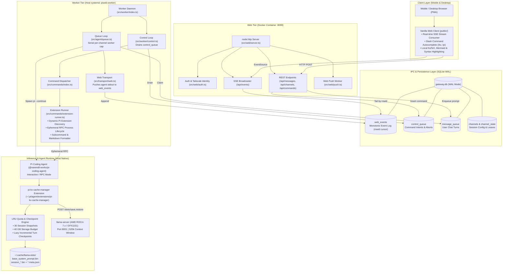
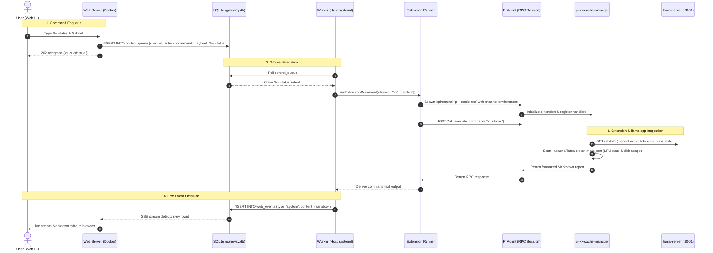
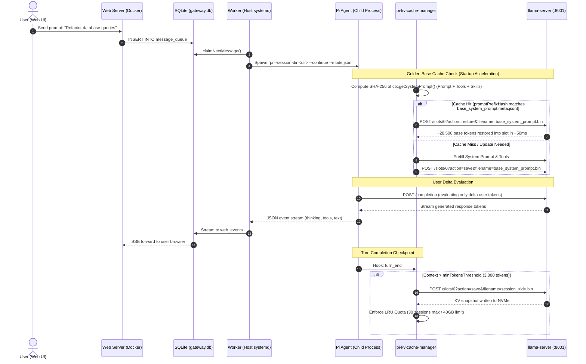

# PiWeb

A mobile-first web front end and local gateway for the [pi coding agent](https://github.com/badlogic/pi-mono). Features a resilient dual-tier architecture (Docker Web UI + Host Worker Daemon), real-time Server-Sent Events (SSE), SQLite WAL message queuing, dynamic extension slash command bridge, and hardware-accelerated KV Cache snapshot management for local LLMs (llama.cpp / AMD ROCm).

---

## 🏛️ Software Architecture

PiWeb is designed around strict separation of privileges and robust process isolation. The web interface runs inside a secure Docker container accessible via Tailscale, while the agent execution engine runs natively on the host to retain full system access (GPU, ROCm inference, Docker sockets, systemctl, and local repositories).



---

## 🔄 Detailed Workflows

### 1. Extension Slash Command Workflow (`/kv status`, `/kv save`, etc.)

Slash commands flow through `control_queue` so the web container never touches the host system directly:



### 2. Interactive Turn with Golden Base KV Restore & Incremental Checkpoint



---

## ⚡ KV Cache & Extension Slash Commands

PiWeb dynamically discovers and routes extension slash commands, featuring first-class autocomplete and live status display for llama.cpp KV cache management:

| Command              | Description                                                                     |
| :------------------- | :------------------------------------------------------------------------------ |
| `/kv status`         | Show KV cache snapshot table, active session tokens, disk usage, and quota info |
| `/kv save [name]`    | Save current session KV cache snapshot (optional custom name)                   |
| `/kv restore [name]` | Restore session snapshot or named snapshot                                      |
| `/kv prune`          | Enforce LRU session count (30 slots) and storage quotas (40 GB)                 |
| `/kv base-update`    | Re-evaluate and cache Golden Base System Prompt & Skills                        |
| `/kv help`           | Show KV cache manager help and command usage                                    |

---

## 📱 Features

- **Mobile PWA First**: Tailored for iOS Safari and Android Chrome with responsive touch controls, bottom input bar, and dark mode.
- **Dual-Tier Process Architecture**: Dockerized frontend container for web exposure, host-native systemd daemon for full hardware privileges.
- **SQLite WAL Event Log**: Crash-resilient message queue with monotonic event replay, offline resume, and optimistic local echoes.
- **Real-Time Streaming**: Live streaming of agent thinking blocks, tool invocations, stdout outputs, and markdown answers via SSE.
- **Zero-CDN Dependency**: Vendored local KaTeX (math), Mermaid.js (diagrams), and highlight.js for strict privacy and local offline usage.
- **Hardware-Accelerated KV Caching**: Up to 100x faster startup via Golden Base pre-caching and incremental turn snapshotting on AMD ROCm/llama.cpp.

## Tools for Pi

The gateway exposes two capabilities through its CLI that **pi itself can invoke**. You don't type these commands in your terminal — you just tell pi in Discord, and it handles the rest.

For example, you can say to pi:

> _"Create a daily task at 9am UTC that generates a summary report"_
> _"Send me report.pdf with a message saying here you go"_
> _"Set a one-time reminder for the 2pm meeting today"_

pi will run the appropriate `piscord task` or `piscord send` command behind the scenes.

### Scheduled tasks

pi can schedule cron-based or one-time prompts through the gateway's scheduler. Tasks are injected into the normal message queue, so they use the channel's configured model, thinking level, and working directory.

Under the hood, pi runs commands like:

```bash
piscord task add \
  --name "daily-report" \
  --schedule "0 9 * * *" \
  --channel dc:123456789 \
  --prompt "Generate today's summary report"

piscord task add \
  --name "meeting-reminder" \
  --schedule "2026-04-05T14:00:00Z" \
  --channel dc:123456789 \
  --prompt "Remind Colin about the 2pm meeting" \
  --once
```

The `--schedule` value uses standard 5-field cron syntax (`minute hour day month weekday`). For one-time tasks, add `--once` and pass an ISO 8601 datetime.

**Task management** — also available via pi:

```bash
piscord task list              # List all tasks
piscord task disable <id>      # Pause
piscord task enable <id>       # Resume
piscord task remove <id>       # Delete
```

### Sending messages and files to Discord

pi can send plain text messages, files, or both to any Discord channel using the gateway's built-in relay.

When you ask pi to send something, it runs commands like:

```bash
piscord send --channel dc:123456789 --text "hello"
piscord send --channel dc:123456789 --file /path/to/report.pdf --text "Here's the report"
piscord send --channel dc:123456789 --file chart.png --file data.csv
```

- `--text` works on its own
- Up to 10 files per message (Discord limit)
- Respects `MAX_ATTACHMENT_BYTES` per file
- Works independently — no running gateway daemon required

## Daemon Management

The setup wizard offers to install a background service automatically. You can also manage it manually:

```bash
piscord daemon install   # Generate + enable service
piscord daemon start     # Start
piscord daemon status    # Check status
piscord daemon logs      # Tail log output
piscord daemon stop      # Stop
piscord daemon uninstall # Remove the service
```

- **Linux** — uses a systemd user service
- **macOS** — uses a launchd user agent
- **Windows** — daemon management is not yet supported; run `piscord start` in a terminal or use Task Scheduler manually

> **Headless Linux servers**: enable user lingering so the service runs without an active login session:
>
> ```bash
> sudo loginctl enable-linger $USER
> ```

## Configuration Reference

Config file location depends on your OS (see Data Locations). On Linux: `~/.config/pi-discord-gateway/config.env`

Most users won't need to edit this file directly — `piscord setup` generates it for you. If you do want to tweak advanced settings, you can edit the file manually, or ask your pi to configure it for you. Run `piscord status` to see the config path on your system.

| Variable                     | Default                         | Description                                                                |
| ---------------------------- | ------------------------------- | -------------------------------------------------------------------------- |
| `DISCORD_BOT_TOKEN`          | _(required)_                    | Discord bot token                                                          |
| `PI_BIN`                     | `pi`                            | Path to pi binary                                                          |
| `PI_MODEL`                   | _(none)_                        | Default model override                                                     |
| `PI_THINKING`                | _(none)_                        | Default thinking level                                                     |
| `PI_CWD`                     | `$HOME`                         | Default working directory for pi; can be overridden per registered channel |
| `PI_EXTRA_FLAGS`             | _(none)_                        | Extra flags passed to pi                                                   |
| `TRIGGER_NAME`               | `pi`                            | Bot trigger name for @mentions                                             |
| `CHANNEL_POLICY`             | `open`                          | Channel access: `open`, `open-trigger`, or `allowlist`                     |
| `EXCLUDED_CHANNELS`          | _(none)_                        | Comma-separated channel IDs to exclude from auto-registration              |
| `MAX_CONCURRENCY`            | `3`                             | Max parallel pi invocations                                                |
| `MAX_SCHEDULED_CONCURRENCY`  | `1`                             | Max scheduled tasks enqueued per tick                                      |
| `POLL_INTERVAL_MS`           | `1000`                          | Queue poll interval (ms)                                                   |
| `SHUTDOWN_TIMEOUT_MS`        | `15000`                         | Graceful shutdown timeout (ms)                                             |
| `AUTO_REGISTER_DMS`          | `true`                          | Auto-register DM channels                                                  |
| `ARCHIVE_RETENTION_DAYS`     | `30`                            | Days to keep archived sessions (0 = never clean)                           |
| `MAX_ATTACHMENT_BYTES`       | `26214400`                      | Max size per attachment (0 = no limit)                                     |
| `MAX_TOTAL_ATTACHMENT_BYTES` | `52428800`                      | Max combined attachment size (0 = no limit)                                |
| `SESSIONS_DIR`               | _(platform default)_/sessions   | Session storage directory (see Data Locations)                             |
| `DB_PATH`                    | _(platform default)_/gateway.db | SQLite database path (see Data Locations)                                  |
| `LOG_LEVEL`                  | `info`                          | Log level: debug/info/warn/error                                           |

After changing config, restart the service: `piscord daemon stop && piscord daemon start`

## CLI Reference

```
piscord setup [token]                         Interactive setup wizard
piscord start                                 Start gateway (foreground)
piscord status                                Show diagnostics

piscord channels                              List registered channels
piscord register <id> <name> [options]        Register a channel
piscord unregister <id>                       Unregister a channel

piscord send --channel <jid> [--text <msg>] [--file <path> ...]

piscord task add --name <n> --schedule <cron|iso> --channel <jid> --prompt <text> [--once]
piscord task list | remove <id> | enable <id> | disable <id>

piscord archive list                          List archived sessions
piscord archive cleanup [--dry-run]           Clean up expired archived sessions

piscord daemon install | uninstall | start | stop | status | logs

piscord help                                  Show help
```

### Register options

| Flag              | Effect                                        |
| ----------------- | --------------------------------------------- |
| `--no-trigger`    | Respond to all messages (not just @mentions)  |
| `--main`          | Mark as main channel (implies `--no-trigger`) |
| `--folder <name>` | Custom session folder name                    |
| `--cwd <path>`    | Override `PI_CWD` for this channel only       |

## Data Locations

Paths are platform-aware. Defaults by OS:

| Item     | Linux                                       | macOS                                                      | Windows                                     |
| -------- | ------------------------------------------- | ---------------------------------------------------------- | ------------------------------------------- |
| Config   | `~/.config/pi-discord-gateway/config.env`   | `~/Library/Application Support/piscord-gateway/config.env` | `%APPDATA%\piscord-gateway\config.env`      |
| Database | `~/.local/share/piscord-gateway/gateway.db` | `~/Library/Application Support/piscord-gateway/gateway.db` | `%LOCALAPPDATA%\piscord-gateway\gateway.db` |
| Sessions | `~/.local/share/piscord-gateway/sessions/`  | `~/Library/Application Support/piscord-gateway/sessions/`  | `%LOCALAPPDATA%\piscord-gateway\sessions\`  |
| pi auth  | `~/.pi/agent/auth.json`                     | `~/.pi/agent/auth.json`                                    | `~/.pi/agent/auth.json`                     |

## Alternative Installation

### npx (quick trial, no global install)

```bash
npx piscord@latest setup
```

### From source

```bash
git clone https://github.com/Crokily/pi-discord-gateway.git
cd pi-discord-gateway
npm install && npm run build
node dist/cli/index.js setup
```

## Troubleshooting

<details>
<summary><strong>pi not found in PATH</strong></summary>

`piscord status` shows "Pi binary: not found".

- Check `pi --version` works in the same shell
- Set `PI_BIN=/full/path/to/pi` in config.env
- Restart: `piscord daemon stop && piscord daemon start`
</details>

<details>
<summary><strong>Missing auth.json</strong></summary>

`piscord status` shows "Pi auth: missing".

- Run `pi` and complete the login flow
- Confirm `~/.pi/agent/auth.json` exists for the same user running the gateway
</details>

<details>
<summary><strong>Daemon service won't start</strong></summary>

- `piscord daemon status` — check for errors
- `piscord daemon logs` — see log output
- **Linux**: for headless servers, run `sudo loginctl enable-linger $USER`
- **macOS**: check `~/Library/Logs/piscord-gateway/` for launchd output
</details>

<details>
<summary><strong>Bot is online but doesn't respond</strong></summary>

- `open` policy: check `EXCLUDED_CHANNELS` doesn't include your channel
- `allowlist` policy: run `piscord channels` — at least one channel must be registered
- For trigger-only channels: mention the bot by name or use `@TriggerName`
- DMs auto-register when `AUTO_REGISTER_DMS=true`
</details>

## Development

```bash
npm install
npm run dev          # Start with tsx (no build needed)
npm run build        # Compile TypeScript
npm test             # Run Vitest suite
```

## Security

- Protect `config.env` — it contains your Discord bot token
- Anyone who can message a registered channel can spend your pi usage
- Review attachment size limits before exposing the bot
- Run the service as a normal user, not root

## License

MIT

## Version History

| Version | Date       | Changes                                                    |
| ------- | ---------- | ---------------------------------------------------------- |
| 1.5.3   | 2026-05-19 | Fix ESM peer-dep check, cross-platform test fixes          |
| 1.5.1   | 2026-05-15 | Startup check for legacy `@mariozechner/pi-ai` package     |
| 1.5.0   | 2026-05-15 | Cross-platform support (macOS, Windows), launchd, new deps |
| 1.4.3   | 2026-05-03 | Compatibility with older pi-ai thinking APIs               |
| 1.4.2   | 2026-04-06 | Fixed default XDG data directory mismatch                  |
| 1.4.1   | 2026-04-06 | Fixed text-only sends via piscord send                     |
| 1.4.0   | 2026-04-06 | Added per-channel working directories                      |
| 1.3.0   | 2026-04-04 | Improved setup UX, faster install                          |
| 1.2.0   | 2026-04-04 | Added channel policy, abort, scheduler, send-file          |
| 1.1.0   | 2026-03-31 | Renamed package to piscord                                 |
| 1.0.0   | 2026-03-28 | Initial release                                            |

See [Changelog](./CHANGELOG.md) for full details.

## Acknowledgments

- Architecture inspired by [NanoClaw](https://github.com/qwibitai/nanoclaw)
- Built for [pi-mono](https://github.com/badlogic/pi-mono) by [@badlogic](https://github.com/badlogic)
