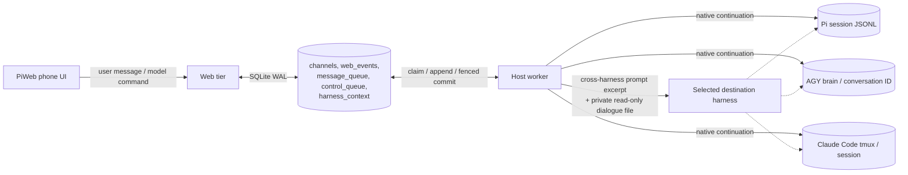

# Cross-harness conversation continuity

PiWeb presents one visible conversation per web channel, but execution can move
among three **independent** harnesses: native Pi (all Pi providers, including
`openai-codex/*` and `local-llama/*`), Antigravity CLI (`agy/*`), and Claude Code
(`claude-code/*`). Each harness owns its own session, tools, permissions, child
agents and provider-specific state. Switching models **within Pi** continues
the same Pi session and never adds a PiWeb history import. Cross-harness
continuity is a bounded transfer of **visible dialogue**, not a conversion or
merge of native histories.

## Architecture and ownership



`src/agent/harness-handoff.ts` classifies a model reference: `agy` maps to
`agy`, `claude-code` maps to `claude`, **every other provider maps to `pi`**.
`src/commands/index.ts` captures the previous harness before changing a model
selection; merely selecting a model does not advance the executing harness.
The worker's `src/agent/queue.ts` decides the target from the effective model
for the _next actual message_. There is no web-tier access to native provider
stores, and no native session file or conversation ID is copied into another
harness.

`src/db.ts` stores one `harness_context` row per channel with the last executing
harness (`active`) and independent last-consumed `web_events.rowid` cursors for
`pi`, `agy`, and `claude`. The record carries `storage_token` and
`ownership_epoch`; reads ignore a record from a different owner generation,
and writes use the channel generation fence. The visible transcript remains in
`web_events`, authoritative for the handoff; it is never rewritten by a switch.

## One model-switch turn, step by step

1. The model picker or `/pi model` sends a control command through SQLite. The
   worker first bootstraps an existing channel's `harness_context` from its
   **previous** model if no state exists, then persists the new model override.
   No dialogue has yet been delivered to the new harness.
2. PiWeb appends the new user message to `web_events` and enqueues it. The host
   worker resolves the effective model and calls `harnessForModel()`.
3. If `active === target`, there is **no extra handoff**. Native continuation
   handles context; this includes Pi → another Pi provider/model. Otherwise the
   worker reads only completed `message` rows with role `user` or `assistant`,
   after the target's cursor and through the latest **completed assistant** row
   preceding the new prompt. The pending user prompt is delivered separately.
   A 5,000-record cap applies to qualifying dialogue, not to intervening tool
   events; older omitted records are counted explicitly.
4. `formatHandoff()` prepends a provenance-labelled JSON-quoted excerpt to the
   new prompt. It has a 32,000-character limit and an explicit omission count.
   A companion `.piweb-handoff-<target>.jsonl` snapshot, up to 5,000 dialogue
   records / 2 MiB, is atomically replaced in the channel session folder with
   mode `0600`. It contains a metadata row (source, target, omission count),
   followed by dialogue rows (`rowid`, `role`, `text`). The prompt names this
   **host-local read-only source path** if older context is needed. The file is
   not a browser download endpoint; this is an opportunity for the agent to
   read more, **not proof that it did**. Either representation may omit history.
5. The chosen harness receives the prompt and continues its _own_ native
   session. Normal intermediate thinking/tool events flow to the PiWeb UI, but
   they do not become input to the next handoff.
6. Only after a successful assistant response is delivered to PiWeb does the
   worker commit `active = target` and that target's cursor to the latest
   assistant event row id. An aborted, failed, or undelivered turn does not
   advance the cursor and can receive the handoff on retry. A model selection
   with no subsequent turn does not count as a completed switch.

```mermaid
sequenceDiagram
  participant U as Phone
  participant D as SQLite / PiWeb dialogue
  participant W as Host worker
  participant O as Opus native session
  participant G as Gemini native session

  U->>D: select claude-code/opus; send code A
  W->>O: prompt, native session continues
  O-->>D: assistant says A; commit claude cursor
  U->>D: select agy/gemini-…; ask about earlier code
  W->>D: read unseen user/assistant rows through Opus reply
  W->>G: quoted PiWeb dialogue + new question
  G-->>D: assistant says A and creates phrase B; commit agy cursor
  U->>D: select claude-code/opus; ask for Gemini's phrase
  W->>D: read dialogue newer than claude cursor
  W->>O: quoted Gemini dialogue + new question; native Opus session preserved
  O-->>D: assistant says B; commit claude cursor
```

## Boundaries, resets and failure cases

- **Included:** only PiWeb `web_events` user and assistant `message` text,
  identified by row id and role. Source text is quoted _data_, not system
  instructions. Tool output, thinking, command/control events, error notices,
  binary attachments and provider credentials are **not** imported. If a user
  pasted a secret in a visible text message, that text is still dialogue and
  may be transferred; use separate channels for different trust domains.
- **Native state stays separate:** Pi's session JSONL, AGY's conversation and
  Claude Code's tmux/native session all remain intact; no cross-provider tool,
  child-agent, permission or working-directory state is promised. Target
  context limits and model interpretation can still affect recall.
- **Pi → Pi:** a model/provider change inside the Pi harness injects nothing.
  Pi itself keeps its native session history; "no handoff" does **not** mean
  "forget the conversation".
- **`/pi new`:** after confirming the channel has no active work, the reset
  rotates the native session directory and advances _all_ harness cursors past
  the old visible dialogue. The screen may still display previous messages,
  but a later cross-harness switch will not silently import them into the fresh
  native session. New channels' automatic `pi new` follows this rule too.
- **Owner changes:** a new `storage_token` or `ownership_epoch` cannot reuse old
  cursors. The feature operates only on `web:` channels. Deleting/archiving
  requires the normal channel ownership fences; the handoff is not a bypass.
- **Failed delivery:** the cursor is intentionally not committed. Repeated
  prompts may see the same quoted excerpt; the archive file may already exist
  because it is prepared before execution. Never interpret its existence as
  proof of a successfully delivered turn.
- **Legacy channels:** first model selection records the old harness before
  modifying the override. Older sessions without a new observed selection are
  not retroactively imported. An explicit `/pi reset-model` records the old
  harness before returning to the gateway default.

## Verification and operation

- Unit / DB / worker routing: `npx vitest run test/harness-handoff*.test.ts test/queue-harness-handoff.test.ts`.
  Coverage includes classification, 5,000+ intervening tool events, 5,000+
  qualifying dialogue records and omission counts, generation isolation,
  aborted retry, Pi → AGY → Claude → Pi routing, Pi model commands, and `/pi
new` excluding archived dialogue.
- Opt-in real-provider mobile walkthrough:
  `PIWEB_HANDOFF_LIVE_URL=<disposable-loopback-origin> PIWEB_HANDOFF_LIVE_TOKEN=<token> npx playwright test test/e2e/harness-handoff-live.spec.ts --project chromium-mobile`.
  Use a disposable web/worker DB, not an existing user session; provide the
  token through the environment, never commit it. It exercises the production
  UI with real Claude Code Opus → AGY Gemini 3.1 Pro → Opus, verifies codeword
  continuity in both directions, checks that three replies survive reload,
  and records a 390×844 mobile video.
- Reviewed isolated evidence: `artifacts/handoff-live-video/workflow.mp4`,
  `contact.jpg` and `report.md` (locally ignored artifacts). This is **not** a
  public-production inference test. The host-worker deployment and public
  Funnel health check were verified separately; those health checks do not
  prove a production-site provider round trip.

For a live deployment, use the service restart hub and wait for active
`message_queue` work and `channel_operations` owners to drain. Do not restart a
worker that owns a live parent or subagents. The web tier need not import this
worker-only module; container and host must still share the same SQLite/WAL DB.
