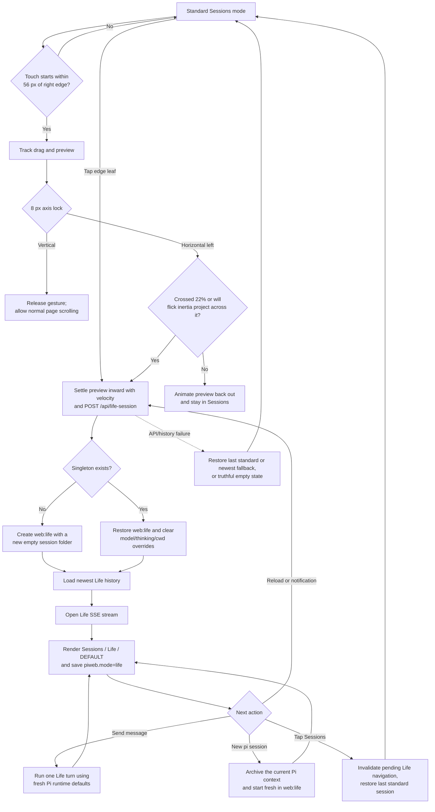
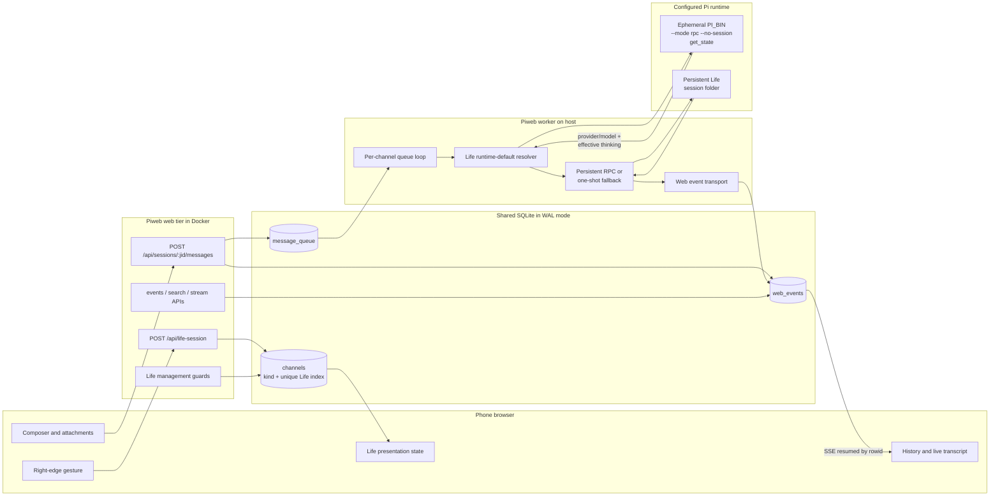
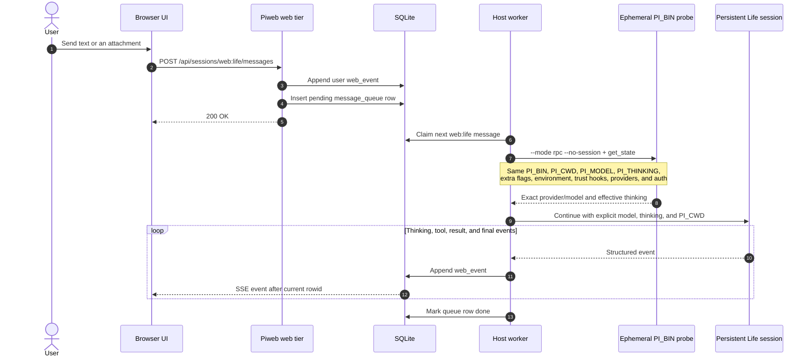
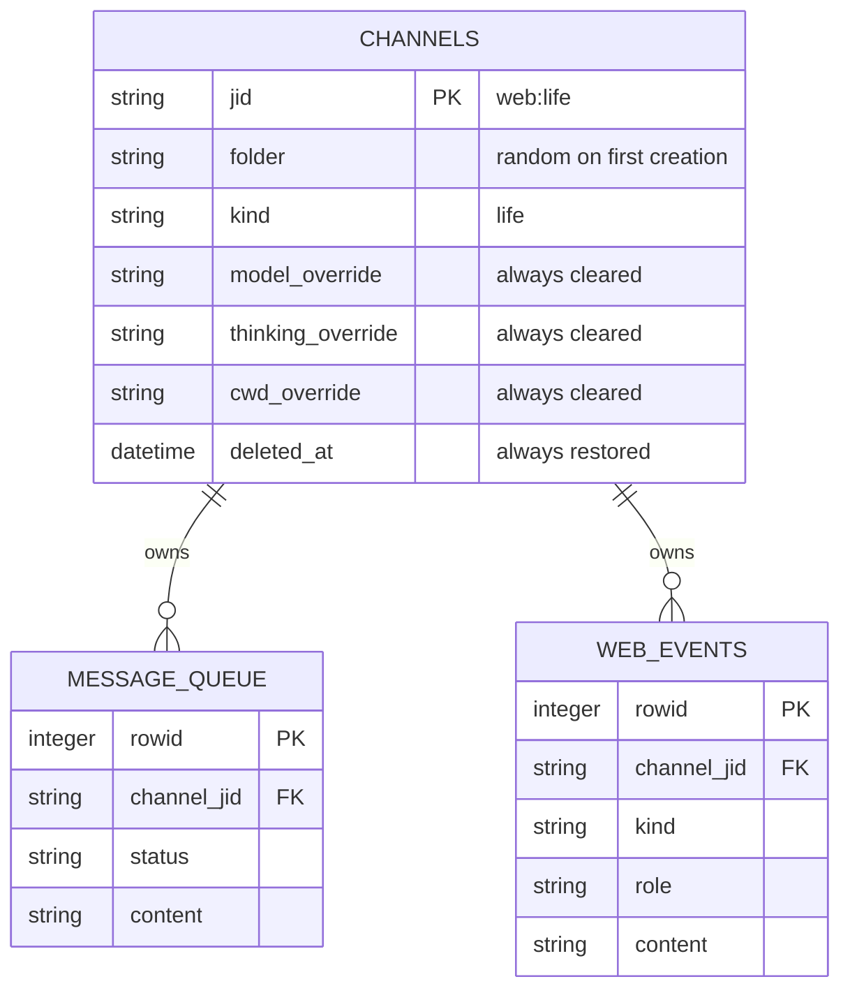
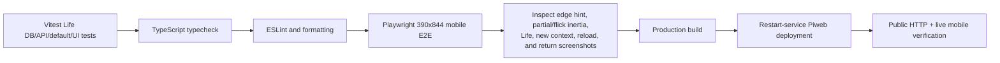

# Life Mode: workflow and software architecture

Life is a deliberately small, persistent chat surface for the current Pi default.
It is not a shortcut that creates an ordinary session: Piweb stores one protected
`channels.kind='life'` channel, reuses its channel and transcript across entries,
and removes channel/model management from its UI. The user may explicitly start
a fresh Pi context inside that protected channel with **New pi session**.

## Product contract

- On a phone, start within 56 px of the **right edge** and swipe left. A drag
  commits after 22% of the visual viewport, while a shorter fast flick commits
  when its projected velocity crosses the same boundary. The 44×64 px edge leaf
  is also a button: tap it to auto-settle the same panel into Life.
- Vertical motion wins after the 8 px axis lock, so the gesture does not steal
  transcript scrolling. Because the fixed button is outside the transcript's
  scroll ancestry, a vertical drag beginning on it forwards that locked motion
  to the transcript explicitly. After release, the settling preview owns pointer and
  keyboard input, blocks the underlying drawer/composer and edge button, and
  moves focus to **Cancel** until Life entry succeeds or fails. Cancellation
  returns focus to the edge button.
- Life has the stable JID `web:life` and one randomly named, persistent Pi
  session folder. The partial unique database index permits only one Life row.
- Re-entry restores the same row and transcript while clearing model, thinking,
  and cwd overrides.
- Every Life turn asks the configured `PI_BIN` for its exact current runtime
  model and effective thinking level, then passes both explicitly to the
  persistent Life conversation. It never trusts stale values from
  `pi --continue`.
- Life always runs at `PI_CWD`; it cannot set a per-session cwd.
- Rename, delete, clear, restore, model, thinking, cwd, and reset-cwd operations
  are rejected server-side. Emergency `pi stop` and **New pi session** (`/pi new`)
  remain available. `/pi new` archives the previous Pi context and starts fresh
  without replacing or exposing the protected Life channel. Life exposes this
  action as a dedicated pencil button in the header, immediately before ⋯. Its
  overflow contains **Search** and **Media**; Sessions, New pi session, clean
  session, and their separator remain hidden there.
- The ordinary composer, attachments, transcript history, streaming events, and
  existing integrations remain available; Life adds no separate voice/ASR stack.
- Returning from Life, or rolling back a failed Life history load, restores the
  last selected standard session when available, otherwise the newest standard
  session. If none exists, Piweb closes the Life stream, clears
  Life history/partial/busy/search ownership, and renders `no session`; a later
  composer submit cannot target `web:life`.
- `localStorage.piweb.mode` stores only the device's presentation mode. It is
  not the source of truth for the Life channel or Pi settings.

## User workflow



The right-edge leaf is both a swipe affordance and an accessible **Open Life**
button; tapping it uses the same inert, cancellable settlement path as a flick.
Entry is disabled above 768 px, while Life is already active or settling, and while a menu, sheet, or
lightbox owns the foreground. Cancelling settlement—or crossing the desktop
breakpoint while it is pending—invalidates navigation and preview ownership,
restores standard mode, and ignores any delayed Life response.

## Software architecture



The web container never starts Pi. It authenticates the Life endpoint, persists
browser-visible state, and writes queue rows. The host worker owns Pi process
execution and runtime-default probing. SQLite is the only coordination channel
between the two processes.

## One Life turn



The probe sends no prompt and creates no conversation history. It has a
15-second timeout and follows the turn's abort signal. Success, timeout, abort,
and parse/error completion first send SIGTERM, wait up to one second, then send
SIGKILL if necessary; the caller resolves or rejects only after the child exits.
Missing or unauthenticated runtime defaults fail closed instead of silently
resuming the Life session with stale settings.

Text-only turns normally use a warm, steerable RPC session. Attachments and the
until-done path use a one-shot Pi process that writes the same session files;
Piweb closes any idle RPC instance first, so the next RPC turn reloads those
one-shot additions instead of continuing from a stale branch.

## Persistence and invariants



Database and API rules:

1. `idx_channels_single_life` is a partial unique index on
   `channels(kind) where kind='life'`.
2. `getOrCreateLifeChannel()` runs transactionally. First creation atomically
   reserves an absent, empty folder and skips any orphaned candidate path, so it
   does not enqueue an asynchronous `pi new` that could race the first message
   or inherit filesystem history. If an unrelated standard row already owns the reserved
   `web:life` JID, creation fails closed rather than inheriting its Pi history.
3. Standard live/trash queries filter Life out; direct Life history and message
   routes remain valid.
4. Every authenticated `POST /api/life-session` restores the singleton and
   clears all overrides before returning it.
5. API guards enforce the simplified contract even when an old or hand-written
   client calls hidden management routes. `pi new` is the deliberate exception:
   it rotates the internal Pi context while leaving the Life row and web transcript
   protected and persistent.

## Frontend ownership and race protection

Life changes the active transcript while session polling, history requests, SSE,
and notification messages can still be in flight. The frontend uses explicit
ownership generations rather than relying on response order:

| Guard | Protects |
| --- | --- |
| `lifeNavigationGeneration` | Every Life, standard, trash-preview, restore, delete-fallback, jump-to-live, and initial boot route has explicit ownership, so late completions cannot mix modes. |
| `sessionSelectionGeneration` | History/search/SSE results belong only to the selection that started them. |
| `searchOwnershipGeneration` | Closing or abandoning Life invalidates delayed search results. |
| `mediaOwnershipGeneration` | A delayed Life gallery cannot overwrite a later standard-session gallery. |
| `sessionsLoadGeneration` | An older session-list poll cannot replace a newer list. |
| Captured destination/operation ownership | Composer sends, new-session creation, clean completion, and trash loads cannot mutate a newer Life or standard destination; submitted attachments detach synchronously so later pastes remain with the newer draft. |

A notification target is consumed from the URL before boot's asynchronous API
loads begin. Piweb removes its session query parameter immediately, so even a
newer navigation that supersedes boot cannot let a later reload undo the user's
subsequent mode choice. Because a background tab's session list may be stale,
the events response also returns channel JID/kind/deleted metadata: Life, live
standard, and trash-preview selections must exactly match their requested
identity and state before becoming active. While validation is pending, Piweb
keeps the composer, Search, Media, rename, stream reopening, and management
controls unavailable and does not commit the candidate as `activeJid`. The Life
endpoint itself must also return the canonical `web:life`/`kind='life'` identity.
Only a confirmed live standard target becomes the
remembered return destination. A missing or
trashed remembered target retries the current standard list, then clears to the
truthful empty shell if every candidate fails. The no-standard-session rollback
additionally clears the active JID before restoring standard chrome, so the
shared composer cannot retain Life as an invisible destination.

## Component map

| Concern | Implementation |
| --- | --- |
| Schema, migration, singleton transaction | `src/db.ts` |
| Channel discriminator and thinking levels | `src/types.ts` |
| Authenticated endpoint and management guards | `src/web/server.ts` |
| Exact Pi runtime-default probe | `src/agent/channel-settings.ts` |
| Per-turn dispatch, RPC/one-shot continuity | `src/agent/queue.ts`, `src/agent/rpc-session.ts` |
| Gesture, mode state, navigation ownership | `public/app.js` |
| Life chrome and edge affordance | `public/index.html`, `public/app.css` |
| Database/API/default-resolution tests | `test/life-*.test.ts` |
| Mobile gesture and navigation E2E | `test/e2e/life-mode.spec.ts` |

## Verification workflow



Focused commands:

```bash
npm test -- --run test/life-session-db.test.ts \
  test/life-session-api.test.ts \
  test/life-default-settings.test.ts \
  test/life-mode-ui.test.ts
npx playwright test test/e2e/life-mode.spec.ts
npm run lint
./node_modules/.bin/tsc --noEmit
npm run build
git diff --check
```

The Playwright fixture proves deterministic browser behavior; it does not prove a
live model response. Deployment verification must separately exercise the real
web container, shared database, host worker, configured `PI_BIN`, and public
HTTPS path.
