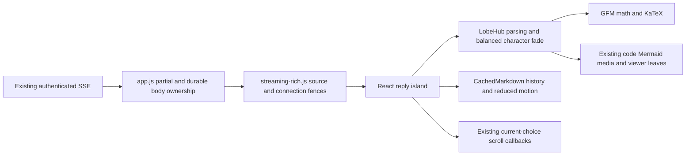
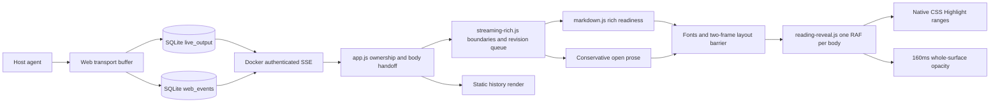

# LobeHub Streamdown reply island

## Current source integration

The selected package is **[`@lobehub/streamdown`](https://github.com/lobehub/streamdown), pinned at 1.4.0**, with React/ReactDOM 19.3.0. It is not Vercel Streamdown. `client/lobehub-rich.jsx` owns a small reply-only root; the rest of the application remains vanilla JavaScript.



- Upstream owns parsing, remend, balanced smoothing, character fade and its 180ms duration. No old piweb animation is called, no custom pace is layered on it, and no `animated` API from the similarly named Vercel package is assumed.
- Compatible final delivery completes the preview row in place, retaining its connected body, React root and Streamdown instance. Even synchronous detach/reinsert restarts completed native CSS fills, so the final handoff does not reparent the body. There is no upstream `complete` prop; EOF does not switch renderer or force a whole-tail flush. The boundary's durable `complete` flag releases `latexGuard` on that same instance: an unrenderable unfinished formula must no longer retain only the last valid partial source. Balanced smoothing, character granularity and the native 180ms fade remain unchanged. Individual animation-tail Text nodes/spans may be coalesced by the library.
- Static assistant/thinking history and reduced motion use the exported `CachedMarkdown`; user messages, tools and ordinary notices still use the existing renderer. CommonMark semantics intentionally replace the old live scanner.
- The island tags its body `lobe-rich`: parsed prose uses `white-space: normal`, so HAST's inter-block/list separator newlines cannot become additional visible blank lines. Explicit prose breaks remain `<br>`, inline code retains `pre-wrap`, and fenced code retains `pre`. The existing paragraph/list margins and line-height are not reduced to compensate. Raw user/tool whitespace styles stay unchanged. The owned class is removed on unmount; live, in-place EOF, history and reduced motion share the same typography scope.
- The maintained `LobeHub screenshot layout walkthrough keeps prose lists and copy usable` regression in `test/e2e/lobehub-streamdown.spec.ts` reproduces a long config-file reply with loose lists and inline/fenced code. One continuous recording covers history, code-text tap-to-copy and pointer-reachable Send, streamed chunks, in-place EOF, reload, light theme and reduced motion; measured margins reject extra whitespace line boxes and document overflow. Run `PIWEB_E2E_PORT=4292 npx playwright test test/e2e/lobehub-streamdown.spec.ts --grep 'screenshot layout walkthrough' --workers=1`. Diagnostic-only `PIWEB_LAYOUT_DEPLOYED_ASSETS=1` replays `app.css` and `lobehub-rich.js` previously captured into `artifacts/lobehub-layout-audit/runtime/`; the default always uses current source assets. A local passing recording does not mean these assets have been deployed or certify physical iPhone/Safari behavior.
- Transport CRLF/leading-whitespace normalization and publication-marker privacy remain at the boundary. An unpublished `[[image/video/file: local path]]` and its following tail are held for durable delivery; compatible earlier paragraphs stay attached.
- `client/outbox-media.js` supplies the shared remark extension for published `[[image: URL]]`, `[[video: URL]]` and `[[file: URL]]` markers. Image files remain inline images at the model-selected positions; other files get friendly download links. Parsed text only is transformed (including GFM auto-links inside markers), never code, math, HTML or explicit link labels. Only `/media/` and HTTP(S) URLs are embedded; raw HTML stays disabled and local preview publication fences stay unchanged. Both Streamdown and static/reduced-motion CachedMarkdown use this extension.
- Assistant/thinking links in both live and historical bodies reuse `markdown.js`'s exact-host/video-ID parser and exported inline YouTube binding (with leaf-owned cleanup), not a second player/parser. Recognized anchors retain `youtube-inline-link`, so delegated copy-link handling cannot intercept them. Unmodified clicks open/replace/close the same privacy-enhanced iframe leaf; modified clicks keep external navigation. Native fading guards still own interaction availability. Embed/network fixtures—not live YouTube—cover all four surfaces in `test/e2e/lobehub-streamdown.spec.ts`.
- Leaf components preserve table scrolling, syntax highlighting, code-text tap-to-copy, KaTeX, native images/video and delegated lightbox use. Ordinary fenced code has no inline copy button or reserved 44px toolbar padding; existing text-selection copy and Mermaid-specific actions remain available in live, durable, historical and reduced-motion bodies. Video forwards upstream leaf props, including className/style. The published-video regression samples a real upstream block fade at 0/90/180ms and verifies inert release; it does not invent an animation for video-only streaming tails. Expensive code/diagram preparation is debounced, not reveal pacing. Upstream-fading controls are inert, and still-fading spans are not selectable; this is an interaction guard, not an animation replacement.
- A detached live root is unmounted after real removal; compatible EOF keeps its row/body connected. Revision/connectivity checks fence obsolete imports; owned motion/resize/animation listeners are released. Late resize callbacks cannot reuse tail-follow intent after reader navigation.

### Publishing and deploying the spacing repair

The repair requires both the class-bearing reply bundle and the scoped prose CSS;
shipping only the CSS cannot affect an older bundle that never adds `lobe-rich`.
Build frontend assets from source; do not commit generated bundles or local video
artifacts. A Web rollout must rebuild the app before recreating its Tailscale
sidecar, which shares the app's network namespace. Keep the host worker and gateway
running; a worker-only restart cannot update frontend files in the Web container.
Reload existing browser tabs after rollout to load the new ESM bundle. Deploying
frontend assets does not reload already-running host worker modules or resolve the
historical legacy-parser review findings described below.

### Build and evidence

```sh
npm run build                 # TypeScript plus the browser bundle/notices
npm run test:e2e -- test/e2e/lobehub-streamdown.spec.ts --workers=1
# Direct Playwright bypasses npm lifecycle hooks: build the client first.
npm run build:client
PIWEB_E2E_PORT=4223 npx playwright test test/e2e/lobehub-streamdown.spec.ts \
  --workers=1 --reporter=list --output=artifacts/lobehub-streamdown/verified
```

`public/lobehub-rich.js` and both license notices are generated/ignored. Docker builds them in the build stage and copies them after public assets into the runtime image. The bundle is outside immutable `vendor/` paths and uses the existing mutable-asset cache policy. Deploying from a shared dirty worktree is still not feature-only publication.

The maintained library spec checks real upstream DOM/CSS, Chinese/emoji source, live/history fence/list shapes, same-root EOF, unpublished outbox privacy, reduced motion, rich leaves, control focus, cancellation and a continuous actual-Send dark/light/static-history video. Its embedded-file-image journey also exercises local preview → published PNG-path markers → lightbox → static history in both themes; inline/nested remote images, file links, code literals and unsafe URL rejection have separate coverage. `test/outbox-media-markdown.test.ts` covers the AST extension and explicit video kinds. Focused regression: `npm run build:client && PIWEB_E2E_PORT=4223 npx playwright test test/e2e/lobehub-streamdown.spec.ts --grep 'embedded file images|published markers preserve' --workers=1`; evidence lives under `artifacts/lobehub-embedded-media/`. The block-spacing regression measures paragraph/list/table/code gaps against their CSS margins across history, real Send/live, same-root durable EOF and reduced motion, while preserving inline/fenced code whitespace, explicit breaks and raw user text. Focused run: `npm run build:client && PIWEB_E2E_PORT=4223 npx playwright test test/e2e/lobehub-streamdown.spec.ts --grep 'block spacing' --workers=1`; evidence lives under `artifacts/lobehub-spacing/`. API/SSE timing is deterministic and independent of screenshots. It is not live-provider or physical iPhone/Safari/PWA evidence.

### Unresolved migration limits

- `client/document-context.js` repairs two block-context losses through public APIs, without replacing the renderer: the `preprocess` callback uses a remark math AST to collapse empty lines only inside display-math nodes (including unfinished nodes, before marked can freeze an internal paragraph). Code/inline-code remain literal. A remark plugin wraps unified's documented `processor.parser`, providing whole-document reference definitions before each independent block is parsed; a post-parse transform alone would be too late because unresolved references have already become text. Parse-only definitions are prepended (never appended into an unfinished code/math tail), removed from visible block children, then canonical document-order definitions are supplied to remark-rehype. First-definition precedence, normalized/collapsed/shortcut references and reference images therefore match history. URL sanitation, HTML skipping and KaTeX trust settings are unchanged.
- `unified@11.0.5` and `remark-parse@11.0.0` are explicit exact direct dependencies, matching the already-installed versions and existing lock entries. They are needed for syntax-aware document context, not a second rendering/animation engine; no upstream files or pinned LobeHub version are modified. Definition snapshots omit positions so unchanged definitions keep upstream plugin options equal during prose growth. Definition changes reparse existing blocks through upstream memoization, without changing root/prefix keys or replaying settled fades.
- Maintained document-context regressions cover progressive chunks, durable EOF/reload, dark/light/reduced motion, safe links/images, first-definition precedence, literal math in code, and desktop native selection/reader offset while a later definition resolves. Mobile uses the existing custom selection UI and intentionally suppresses native ranges. This adapter does not repair cross-block footnotes, migrate incomplete-tail remend semantics, or certify every nested math/Markdown construct. Whole-document AST context adds linear parsing work per source snapshot; long-transcript performance is not newly benchmarked.
- The previous custom-renderer E2E suite still includes obsolete frontier/Highlight/invisible-preparation expectations. A passing library/interaction subset is not an all-E2E green claim. The OFF-scroll regression replaces only its obsolete `--reply-front` assertion with actual retained-content verification.
- The historical indented-fence publication review remains uncleared. New live/static indented-fence coverage is evidence for this replacement, not an approval of legacy code or an independent publication review.
- Dependency audit results, missing independent review and any baseline Settings fixture failure must be disclosed before publication/deployment. No automatic audit fix, commit, push, worker restart or deployment is implied by local preview.

## Historical custom reading-order implementation

The remaining presentation sections record the superseded renderer, **not the current reply-island algorithms or build assets**. Durable-delivery, auto-scroll, exact Send and keyboard ownership contracts below remain applicable; old Highlight/frontier/wrapper/preparation rules do not.

Live assistant replies and thinking reveal native text in source reading order. Only the newest **eight graphemes** have a short soft-colour edge; already-read text stays clear. Settled images, tables, code, diagrams and math fade as complete surfaces over **160ms**, independently of their physical dimensions and unrelated text backlog. There is no diagonal wipe, per-character wrapper, translated duplicate or whole-answer buffer. This is a qualitative presentation redesign, not a claim about GPT app internals.

## Software architecture

The browser owns presentation, not agent scheduling or persistence. Existing host-worker generation, transport buffering, SQLite snapshots and authenticated SSE are unchanged. Transport batching (150ms) and SSE polling (400ms) are not introduced by reveal and cannot measure model decode TPS.



| Component                  | Ownership                                                                                                                  |
| -------------------------- | -------------------------------------------------------------------------------------------------------------------------- |
| `public/app.js`            | Session/source fences, partial/final wrapper identity, compatible rich-body reuse, history and current scroll intent.      |
| `public/streaming-rich.js` | Normalized source, stable boundary, revision-fenced serial preparation, conservative native prose preview and promotion.   |
| `public/markdown.js`       | Existing production rich rendering, Mermaid and image decode/error readiness; no new parser.                               |
| `public/reading-reveal.js` | Grapheme-safe native ranges, one monotonic text frontier/RAF, smoothed pace, owned range cleanup and rapid atom readiness. |
| `public/app.css`           | Four controller-owned Highlight colour levels, pending opacity and interaction guards; no geometry mask.                   |

### State and lifecycle

A module-private WeakMap belongs to the actual body node, not the changing partial/final wrapper. Answers and thinking have independent controllers. `source`, `boundary`, `revision` and `queue` retain their existing ownership meaning; the accepted source offset is not the visible-text count. `preview` owns only a conservative unfinished plain paragraph and its native Text node. The reading controller tracks `front`, `goal`, `speed`, prepared items, grapheme offsets, RAF timing, reduced-motion listener and its own Highlight ranges.

`updateStreamingRich` accepts growing snapshots and resolves after queued preparation, not after all text becomes visible. EOF flushes the remaining source into the same body/controller; it neither resets progress nor releases a whole hidden tail. Normalization and compatible trailing-whitespace final handoff are retained. A substantive committed-prefix rewrite invalidates the revision, clears owned ranges and resets that affected body. Superseded readiness jobs check connectivity/revision before publication; cancellation does not abort an already-issued image request.

### Incremental preparation and promotion

Stable Markdown still goes through the existing parser/readiness barriers. A conservative single-line prose tail beginning with a letter/number can also appear before a closing blank line: one native paragraph/Text node receives `appendData`, rather than repeated HTML rebuilds. Markdown-sensitive symbols, URLs, list prefixes, math and publication-marker syntax remain buffered. Ordinary repeated snapshots do not append duplicate runs.

When plain prose becomes stable or reaches EOF, the same paragraph/Text node is promoted. Compatible inline formatting retains the already-read plain prefix and appends only newly parsed nodes. A genuinely revised or structural provisional tail may be replaced; committed blocks are not rebuilt. This limited preview is not a replacement incremental Markdown parser and does not repair the historical indented-fence disagreement.

Rich readiness happens while detached. Prepared rich atoms get independent inert wrappers; adjacent text retains its stable source cohort. They are laid out invisibly, await fonts and two paint boundaries, then join the controller. A ready image/table/code block therefore does not inherit a paragraph's text backlog or inertness. Pending assets can still hold later serial preparation; a never-settling readiness timeout remains deferred.

### Native text and whole-surface paint

`Intl.Segmenter` supplies UTF-16 grapheme boundaries, preserving combining characters and joined emoji. Native CSS Highlight ranges cover hidden text and three soft-colour levels. Only an eight-grapheme edge transitions through 25%, 50% and 75% text colour; older text has no overlay. Ranges are coalesced, not one wrapper/timer per character, and each controller deletes only its own ranges. Other highlight owners and native selection are not cleared.

Rich atoms use 160ms opacity on the whole native surface, not a spatial scan. Their zero-text items finish independently of the text goal. Already-ready nodes are skipped by paint; temporary visibility/opacity and empty presentation-only style attributes are removed. Native wrapping/size changes cannot rewind text offsets or grant unrelated future content progress; internal thinking scrolling does not alter the reading frontier.

Idle completion removes RAF/media listeners/ranges while retaining the frontier. A later append joins without replay; cold resumption starts at 80 graphemes/s. Detachment or revision stops abandoned work. Reduced motion, absent CSS Highlight support or closed zero-height thinking shows settled content immediately. Legacy exported geometry/row/pace helpers remain pure compatibility APIs only; production does not call them.

### Operational boundaries

- This is incremental display of received/prepared content, not a guarantee of motion while no new content is available.
- Pending/revealing native blocks remain inert/aria-hidden; already-ready blocks and independent ready media remain interactive.
- History stores source, not Highlight or RAF state, and renders without live animation.
- Scroll ownership, native layout and the palette/composer/viewer controls are unchanged.
- `app.css`, `streaming-rich.js` and `reading-reveal.js` must ship together. No deployment is implied by local recordings, and shared-tree Docker packaging is not feature-only Git publication.

## Streaming and finalization

### Durable-delivery handoff

Native `turn_end` / `agent_end` is not the moment when the Web reply becomes durable.
The queue may still be finishing delivery or publishing attachments. Clearing
`live_output` at native EOF used to remove the visible partial before the final
event existed, forcing a new render when that event eventually arrived.

`src/transport/web.ts` now retains answer text across native EOF and awaited file
publication. `src/db.ts` → `commitWebReply` inserts the final event and consumes its
preview in one fenced SQLite transaction; pending buffer timers are then cancelled.
`clearTyping` still discards an aborted/unpublished preview. Tool-call narration
still moves to the thinking lane rather than masquerading as a final answer.

The SSE reader uses `getWebStreamSnapshot`: channel metadata, events, busy and
partial state come from one WAL read snapshot. It drains reconnect event batches
before sending a clear, so a final outside the current page cannot lose its
partial early. New-turn previews are also delivered when their sequence counter
restarts between polls. Transport-only whitespace trimming preserves compatible
rendered bodies; a substantive committed-prefix rewrite remains a real revision.

### Browser preparation

- `public/streaming-rich.js` buffers unfinished rich syntax; eligible plain prose uses a native paragraph/Text preview instead of raw Markdown or per-token `.ink` spans.
- Blank-line boundaries are accepted only outside fenced code and multiline math, before any transport-owned `[[image: ...]]`, `[[video: ...]]` or `[[file: ...]]` marker. Delivery may replace or remove those markers, so the marker-containing block and its subsequent tail wait for the durable final source; earlier ready blocks remain visible and are not replayed. Ordinary Markdown images with stable URLs continue preparing/revealing during streaming. Lists remain buffered through blank-line/indented continuations until an outdented non-item or finalization closes them. An unfinished next-marker prefix (`-`, `+`, `*`, digits, or digits plus `.`/`)`) does not prematurely close the list. List recognition follows the production parser's indentation acceptance, including spaces and tabs, rather than assuming a CommonMark 0–3-space limit. CRLF and the transport's leading-whitespace normalization are applied consistently.
- Assistant previews apply the same repeated-blank-line collapse as reply delivery (`parseOutboxMarkers` / `embedOutboxMediaUrls`), preventing delivery-only whitespace changes from invalidating already-rendered content. Thinking does not use that assistant-delivery normalization.
- Only newly completed rich source is sent to the production `renderRich`; eligible prose appends native text. Previously committed DOM is retained, compatible plain-prefix promotion preserves native paragraph/Text identity, and a revised provisional tail cannot rebuild older blocks. Rewriting committed source intentionally resets the affected reply.
- Mermaid rendering and image decoding finish while the new block is detached. The ready block is laid out invisibly, font loading is awaited, and a two-frame paint boundary precedes the reveal. Historical Mermaid also hides its temporary source while rendering; the existing code fallback remains available if Mermaid cannot render.
- Chunk wrappers preserve native Markdown margin collapsing. The mobile regression compares heading, paragraph, code, diagram and list geometry before/after reload within 0.2px; it caught and fixed a 6px spacing difference during visual review.
- A final SSE event replaces its partial in the existing transcript slot, reuses compatible rendered nodes and flushes the remaining tail. It does not wait for a later partial-clear event, duplicate the answer or replay old paragraphs. Expanded thinking retains its disclosure state. Late reasoning previews and durable thinking events whose preview was missed are inserted before the current answer preview, after previous turns; finalization never moves an existing thinking row below its answer. Removing the streaming caret at EOF can legitimately shorten the expanded body without changing its transcript order.
- Queue revisions and connected-target checks discard obsolete async work after replacement, partial removal or session changes. Finalization while an image is still preparing retains exactly one queue and one copy of the image.

Conservative plain prose can now appear before a closing blank line. Unfinished rich syntax still waits for a safe boundary or EOF; generation indicators remain visible. This preserves finished formatting without imposing whole-answer buffering.

## Motion and interaction

One RAF per body advances a monotonic **grapheme coordinate**, not diagonal pixels. Compatible final handoff preserves native body/text nodes and already-read ranges. Whole rich surfaces finish their brief fades independently; reflow changes ordinary native wrapping, not reveal progress.

### Reading pace (`public/reading-reveal.js`)

- Target = remaining text backlog / 1.2 seconds, clamped to **80–3200 graphemes/s**.
- **250ms exponential smoothing** changes speed without abrupt per-packet jumps.
- Elapsed time is capped at **48ms** so a suspended frame does not reveal an entire tail on return.
- The **eight-grapheme** edge is independent of line width, font size and media dimensions.
- EOF uses the same reading controller/rules, without a special whole-tail completion or replay.
- `--reply-front`, `--reply-speed` and `data-reading-visible` are test diagnostics in grapheme units, not model tokens/second or geometric pixels.

Text insertion/layout remains native. Prepared atoms fade over 160ms, with one body RAF rather than individual animation timers. Unavailable source/unfinished syntax or delayed assets can still cause waits; no dedicated never-settling asset timeout is added. Browsers without CSS Highlights and reduced-motion users receive settled content immediately. Chunk-scoped inertness protects hidden controls; historical text and completed content do not replay. Native selection/copy, links, media and disclosure interactions retain their ordinary workflow once ready.

### Auto-scroll preference

Settings → General → **自動捲動** controls automatic following for the main and Life
transcripts. It defaults **OFF** and is stored per browser as `piweb.autoScroll`.
The full-row switch uses existing Settings outline icons and capsule styling,
`role="switch"`, `aria-checked`, a help description and a 54px minimum row height.

OFF prevents partial/final updates, async media readiness and composer focus from
following the reply. Normal prompt submission is now explicit turn navigation,
not automatic reply-following: it puts the new saved question at the top. Turning
OFF releases existing
composer locks; deferred callbacks consult the current choice. Browser scroll
anchoring is disabled for the OFF transcript too, since it can move the viewport
even without JavaScript `scrollTo` calls. Older-history prepends retain their explicit
re-anchoring. ON retains near-tail-only following and respects reader gestures.

Manual scrolling, **Jump to present**, and opening a session at its latest page
remain intentional navigation regardless of the preference. Turning ON does not
jump automatically: a reader above the tail must choose to return. Native layout
changes and explicit disclosure/navigation actions are not frozen by this option.
BTW and child transcript surfaces are outside this setting's current scope.

### Submitted prompt at the top

Typing alone does not scroll. On a valid normal Send, the composer dismisses its
keyboard and `public/prompt-turn-scroll.js` captures the current selection owner.
The POST acknowledges the exact saved user `eventId`, returned together with its
queue ID by `commitWebMessageOperation` in one fenced transaction. The legacy
`commitLifeMessageOperation` still returns only the queue ID. No schema change or
harness context change is needed.

The browser matches that ID to a saved `.msg-user` row, whether the SSE event or
HTTP acknowledgement arrives first. Only then does it remove that row's pop-in,
reserve one visible turn and align the question's outer row with the transcript's
clipping edge. The row's own padding provides breathing room. A separate top inset
would expose the preceding row, because scroller padding does not clip history.
The scroll target rounds upward to prevent fractional-pixel slivers. This explicit
send navigation applies with auto-scroll OFF as well as ON.

#### Smooth Send and keyboard dismissal

Send captures keyboard visibility **before** `input.blur()`. The controller owns
one `waiting → moving → anchored` transition; its real `scrollTop` moves over
**360ms** with cubic ease-in-out. It does not translate a duplicate message or set
global CSS `scroll-behavior: smooth`. Layout targets are cached between actual
mutation/resize updates, rather than measuring every historical row each frame.

For an iPhone-style visual viewport shorter than the layout viewport, a Send waits
for closure reporting, a **220ms** initial guard, **120ms** of quiet after the last
changed viewport height/offset/size, and two layout frames. The guard is not an
assumed fixed keyboard-animation duration: later resize/scroll reports restart
quiet settlement. Identical geometry reports do not extend the wait. A **1000ms**
keyboard-wait fallback prevents a stale open-keyboard report from holding navigation
forever; the current layout is used, not an assumed full-screen keyboard height.
It never bypasses the 120ms viewport-quiet requirement: delayed acknowledgements and
fresh geometry changes after the fallback threshold still settle before scrolling.
A real geometry change during motion pauses and resumes from the current position,
not from the original scroll position. Continued geometry changes can delay
completion; these bounds are not a physical Safari timing guarantee.

Automatic reply/asset following is suspended while a send or its transition owns
scrolling, including deferred finalization callbacks. This prevents ON from jumping
to the tail in the middle of the animation. Typing/refocusing, wheel/touch/pointer
reader input, manual Jump, newer submissions and navigation cancel obsolete motion.
Cancellation stops the owned RAF without restoring its original starting position.
The reservation remains when a reader merely takes control; navigation/Jump removes
it. `prefers-reduced-motion: reduce` positions without a tween but still respects
keyboard settlement; changing that preference during motion finishes it once.

The keyboard browser tests mock only the visualViewport reporting boundary, while
running the production UI/renderer/CSS. They intentionally leave the layout viewport
full-height and include a late offset report, enabled following, real composer
refocus, reduced motion and a dark/light continuous journey. A cleared multi-line
draft legitimately resizes its composer independently of those keyboard reports.
These fixtures are not a physical iPhone/Safari/PWA or native IME verification.

Reservation is **bottom padding on the transcript**, not cloned messages, fake
history or a spacer after each row. It is `max(0, viewport height -
actual turn height - base bottom padding)`: short answers keep whitespace below,
ready reply/media growth spends it, and long answers need no extra whitespace.
Mutation/resize observations batch measurement; reveal-mask animation alone does
not cause per-frame remeasurement. A temporary rich-body replacement may clamp
native scrollTop before padding is recalculated; the still-owned prompt position
is restored rather than following the new answer to its bottom.

Thinking/tool disclosure activation uses one synchronous layout transaction:
change `details.open`, recompute the current turn's reservation, then restore the
pre-click scroll offset before painting. Native collapse can otherwise clamp
`scrollTop` before ResizeObserver replenishes the padding, exposing older history
and incorrectly showing Jump to present. `preserveLayout` keeps a released reader
pin released and checks exact turn/selection ownership before restoring. Delegated
summary clicks cover partial and durable rows plus native Enter/Space activation;
ordinary history without a submitted turn retains its native scroll bounds. Real
wheel/touch history-reading gestures remain authoritative. The maintained
`prompt turn thinking disclosure` browser test checks repeated open/close cycles,
keyboard activation, summary geometry, jump-button state and later manual scrolling.
Evidence is recorded under ignored `artifacts/thinking-scroll/`; this is Chromium
fixture coverage, not a physical Safari/iPad claim.

The same synchronous layout transaction also covers the working-indicator
visibility change and the complete live preview-to-final wrapper handoff.
Removing the caret or hiding `pi is working…` can otherwise clamp the viewport
before reservation remeasurement, even when the rich-body DOM is reused.
Preserving an existing reader offset does not reclaim a released prompt pin.

The auto-scroll preference governs later growth: OFF holds position; ON follows
only from the tail when overflow requires it. Pointer/touch/wheel/keyboard reader
interaction releases pending navigation and viewport re-pinning. Manual Jump to
present removes the reservation; navigation clears observers, owned padding and
pending acknowledgements. Stale selections, newer submissions, malformed/lost
acknowledgements and failed requests cannot claim another conversation. Identical
prompt text is not used as identity. Slash commands and BTW are not normal-turn
anchors. Static history does not retain empty viewports after reload.

Viewport resizing is covered by Chromium fixtures, not a physical iOS keyboard
or PWA test. An explicitly detached search/history page (`atLive=false`) still
requires Jump to present to resume live appends before a new prompt can anchor;
ordinary upward scrolling/pagination remains live and keeps old history above.

Composer input, native selection/copy, links and image actions keep their ordinary
workflow.

## Verification

The maintained `final delivery continuous video walkthrough` test records one
continuous mobile journey: real Send, repeated-blank-line text growth/finalization,
a second Send, expanded thinking, an unpublished media tail, published image and
final text. It samples every animation frame for original body/anchor identity,
already-ready chunks, reveal-front monotonicity, heading drift, overflow and
visible error states, and also collects console/page/network errors. Run with:

```sh
PIWEB_E2E_PORT=4255 npx playwright test test/e2e/render-reveal.spec.ts \
  --grep 'final delivery continuous video' --workers=1 --reporter=list \
  --output=artifacts/final-video/recording
```

`artifacts/final-video/evidence/` contains H.264 MP4, milestone screenshots,
full decoded-frame sheets, per-RAF metrics and the inspection report. That
specific recording was reviewed through every distinct consecutive decoded
frame (including exact-duplicate coverage), not merely one frame per second.
It uses isolated API/SSE fixtures and a copy of deployed static assets, not a
physical Safari/iPad or a real provider-generation/network timing test.

```sh
npx vitest run test/streaming-rich.test.ts test/thinking-stream.test.ts \
  test/live-output.test.ts test/transcript-scroll.test.ts test/web-reply-handoff.test.ts \
  test/prompt-turn-scroll.test.ts test/life-session-api.test.ts
# Send → question at top / blank answer area → short/long growth → manual jump;
# The 'prompt turn submission raises' regression also checks every preceding row
# is fully above the clipping edge (no previous-message sliver), then short/long
# replies, next Send, dark/light, viewport resize and manual history reading.
# next turn, keyboard-quiet smooth Send, reader/refocus cancellation, reduced motion,
# viewport changes, ON follow without animation snap and pending-image OFF.
# Settings OFF → submit navigation → hold stream/final position → ON → OFF;
# persisted choice, delayed assets, native anchoring, final DOM/frontier identity.
PIWEB_E2E_PORT=4212 npx playwright test test/e2e/render-reveal.spec.ts \
  --grep 'prompt turn|auto-scroll' --workers=1 --reporter=list
PIWEB_E2E_PORT=4194 npx playwright test test/e2e/render-reveal.spec.ts \
  --workers=1 --reporter=list
# Reading-order preview: real Send → independent prose packets → fast whole media/table/code
# → final native-body handoff → light Send → composer → static history.
PIWEB_E2E_PORT=4222 npx playwright test test/e2e/render-reveal.spec.ts \
  --grep 'reading-order soft' --workers=1 --reporter=list \
  --output=artifacts/render-reveal-reading/recording
```

The maintained new contracts cover grapheme boundaries, the narrow fade edge, smoothed/frame-capped pace, conservative plain-tail eligibility, early open prose with native paragraph/Text identity through EOF, inline-format promotion, bounded whole-image readiness without masks, rapid independent media readiness despite a long text backlog, Highlight ownership/cleanup and unsupported-API fallback. Existing source-hierarchy, source/asset ownership, reduced motion, reflow, hidden-future touch selection with a ready positive control, disclosure, finalization and scroll tests remain maintained.

The continuous production-UI recording uses independently timed SSE packets/final events, actual hit-tested Send, dark/light themes, code/table/large image, compatible native final reuse, composer and static history. Per-RAF data checks body/paragraph/Text identity, monotonic progress, relative geometry, no masks/overflow/error states and console/page/network failures. Evidence and archived obsolete diagonal-only contracts live under ignored `artifacts/render-reveal-reading/`. Contact sheets and full-size milestones are decoded-image inspection, not direct playback, every-frame full-resolution scrutiny, physical iPhone/Safari/PWA testing, measured GPU/compositor FPS or real-provider/network cadence.

Earlier diagonal/steady-tail and row/relay recordings are historical, not evidence of user acceptance of this new presentation. The indented-fence parser publication blocker remains **unrepaired and uncleared**. Local gates/recording do not authorize deployment, commit or push; user visual confirmation is required before a new deployment. The independently known Settings/device-code fixture's system-metrics 404 remains outside this feature and is not called green.

The broader history suite has a pre-existing screenshot mismatch: expected transcript height 734px, actual 711px. Serving exact pre-feature assets while preserving unrelated dirty files reproduces the identical 390×711 screenshot pixel-for-pixel. Its baseline was not updated to hide the mismatch; see the evidence report.
