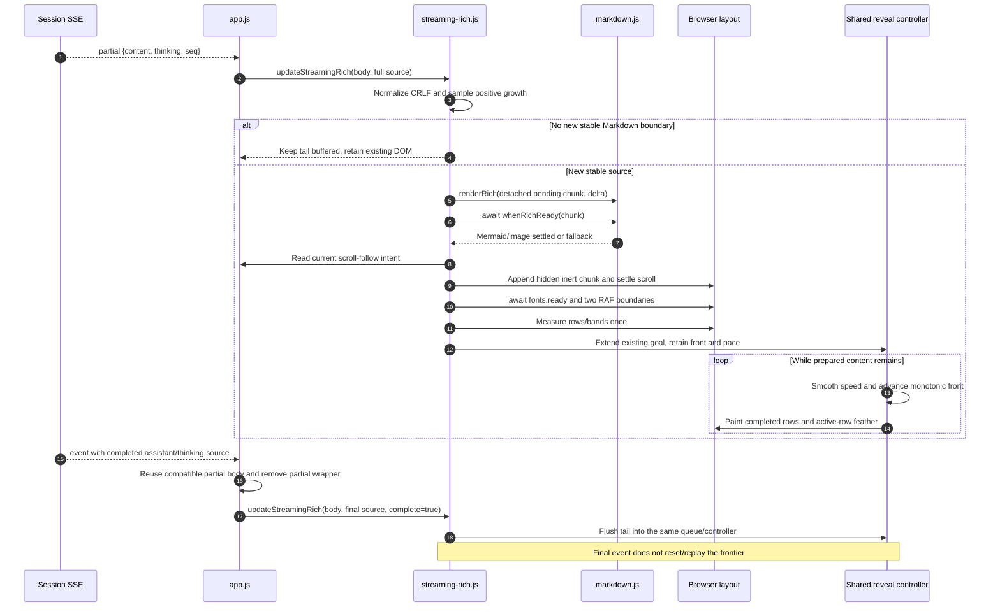

# Render-first reply reveal

Live assistant replies and thinking finish rendering stable Markdown before showing it. Each reply owns one soft reading-order front: it scans text rows left-to-right and proceeds down to the next row. New prepared content joins its current position instead of starting an independent block fade. Text stays in place; the existing PiWeb colours, composer and viewer controls remain unchanged.

## Software architecture

The reveal is a **browser presentation layer**, not a new agent scheduler or
transport. The host worker still owns generation and tool execution; Docker
still serves authenticated APIs/SSE; SQLite remains the process boundary. The
browser receives growing source snapshots and prepares/reveals rich content
independently of when the next network packet arrives.

```mermaid
flowchart LR
    subgraph Host[Host worker]
        Agent[Agent text and thinking deltas]
        Transport[Web transport buffer]
        Agent --> Transport
    end
    subgraph Storage[Shared SQLite]
        Live[(live_output snapshots)]
        Events[(web_events final transcript)]
    end
    subgraph Web[Docker web tier]
        SSE[Authenticated session SSE]
    end
    subgraph Browser[Browser presentation]
        App[app.js stream ownership and DOM handoff]
        Source[streaming-rich.js source boundary and revision]
        Pace[Arrival history and adaptive pace]
        Rich[markdown.js renderRich and whenRichReady]
        Layout[Fonts and two-frame layout barrier]
        Rows[Cached text rows and media bands]
        Flow[One RAF controller per rich body]
        Mask[app.css local row masks]
        History[Static historical render]
    end
    Transport -->|growing source| Live
    Transport -->|completed events| Events
    Live -->|partial snapshot| SSE
    Events -->|durable event| SSE
    SSE --> App
    App -->|live update| Source
    Source -->|positive growth, even unfinished tails| Pace
    Source -->|new stable source or EOF tail| Rich
    Rich --> Layout
    Layout --> Rows
    Rows --> Flow
    Pace --> Flow
    Flow -->|shared coordinate and active row X| Mask
    App -->|paging or reload| History
```



### Component ownership

| Component                                                                                    | Responsibility                                                                                                                                                                            | Does not own                                                          |
| -------------------------------------------------------------------------------------------- | ----------------------------------------------------------------------------------------------------------------------------------------------------------------------------------------- | --------------------------------------------------------------------- |
| `src/transport/web.ts`                                                                       | Accumulates answer/thinking deltas; publishes `live_output`; persists completed `web_events`. Existing live-buffer flush interval is 150ms.                                               | Markdown layout, reveal timers or model decode-rate measurement.      |
| `src/web/server.ts` → `streamEvents`                                                         | Polls SQLite every 400ms and emits `event`, `partial` and `busy` frames on `/api/sessions/:jid/stream?after=cursor`. Durable events advance the reconnect cursor.                         | Agent execution or per-row animation.                                 |
| `public/app.js` → `openStream`, `renderPartial`, `growInto`, `appendEvent`, `buildEventNode` | Fences SSE callbacks by selected session/source; owns partial/final containers, history rendering and current transcript scroll intent.                                                   | Token spans, line splitting or independent block fades.               |
| `public/streaming-rich.js`                                                                   | Owns normalized source, accepted boundary, revision-fenced serial preparation queue, row geometry, arrival samples and the shared visual controller.                                      | Backend queues, persistence, model/server TPS or text layout changes. |
| `public/markdown.js` → `renderRich`, `whenRichReady`                                         | Builds normal rich DOM; tracks Mermaid promises and waits for image decode/error fallback before live display. KaTeX renders synchronously when available; layout/font readiness follows. | Reveal position and speed.                                            |
| `public/app.css` → `.reply-chunk` masks                                                      | Composites completed rows and the active horizontal feather; keeps future rows hidden and graphics in vertical bands.                                                                     | Source parsing, RAF ownership or network scheduling.                  |

Transport batching and SSE polling are existing behavior, not delays added by
this feature. A received snapshot may contain many tokens, so client-observed
source growth cannot identify exact model decode TPS.

### State and contracts

State is held in a module-private `WeakMap` keyed by the **actual rich-body DOM
node**. Answer and thinking each have their own body/controller; they do not
share one global page cursor. The final wrapper may change while the compatible
body node, its state and prepared children remain the same.

| State                                     | Meaning                                                                                                                                                                      |
| ----------------------------------------- | ---------------------------------------------------------------------------------------------------------------------------------------------------------------------------- |
| `source`, `boundary`                      | Latest normalized source and the last accepted/scheduled stable source offset. The boundary is not a count of already visible characters.                                    |
| `revision`, `queue`                       | Generation fence and serial Promise chain for source-ordered async preparation. A pending asset can hold later chunks; received source/pacing samples still update.          |
| `flow.front`, `goal`                      | Monotonic vertical-equivalent progress and the extent of all prepared chunks. Row X is a projection of this progress, not an independent timer.                              |
| `pace.samples`, `highWater`, `speed`      | Bounded receive-time history, largest observed source length and smoothed current velocity. Units are JavaScript string-length units, including Markdown/UTF-16, not tokens. |
| `items`, `preparedChars`, `pixelsPerChar` | Prepared chunks, cached local rows/bounds and calibrated source-to-height density.                                                                                           |
| `frame`, `clock`, `observer`, `media`     | Owned RAF, timing anchor, ResizeObserver and reduced-motion listener; disposed on idle completion, invalidation or detachment.                                               |

`updateStreamingRich(target, text, { complete, beforeAppend, afterAppend })`
accepts full growing snapshots. Its returned Promise represents **preparation
queue completion**, not the moment every pixel is revealed. `complete: true`
means source EOF and flushes the tail; the visual frontier may still be moving.
`canReuseStreamingRich` compares normalized incoming source against the accepted
prefix, so only compatible bodies are reused at final handoff. Normalization
removes leading outer whitespace from the first partial, matching the transport's
final `trim()`, while retaining trailing blank lines needed for Markdown boundaries.
EOF may remove the accepted prefix's trailing whitespace only when its trimmed
form exactly equals the final source; the accepted offset is rebased to that final
length. Other substantive prefix rewrites still invalidate the body.

### One live reply: exact workflow



Each async job checks target connectivity and revision before/after readiness
barriers. A committed-prefix rewrite increments the revision, stops the old
controller, clears its DOM and starts a new flow. Old preparation results are
discarded; this fence does **not** abort an in-flight image request. Unfinished
suffix revisions preserve the accepted prefix and prepared nodes.

At a prepared-content boundary the controller releases its RAF/observer/media
resources and retains position plus learned slow velocity. A later chunk resumes
that same flow; exceptional catch-up speed is capped back to the baseline.
Reduced motion or closed zero-height thinking releases prepared content without
animation. Resizing a started chunk releases it instead of remasking read words;
unstarted chunks are remeasured. Removing/replacing the body causes ownership
checks to stop the abandoned controller.

### Reading-order geometry and paint

Text-node `Range.getClientRects()` measurements are grouped into overlapping
visual rows. The space between adjacent glyph bands belongs to the row bands;
inline fragments merge without changing the original DOM. Rich atoms are
measured once as text or media bounds. Chunk offsets use target **content space**:
`chunk.top = chunkRect.top - targetRect.top + target.scrollTop`, so an expanded
thinking body's internal scrolling never advances its reveal. For a text row:

```text
localFront = flow.front - chunk.top
progress   = clamp((localFront - rowStart) / rowBandHeight, 0, 1)
rowX       = row.left - 56 + (row.right - row.left + 56) * progress
```

The first row also consumes the initial 56px cold-start budget. CSS uses one
opaque mask rectangle above `row.top` and one 90-degree feather limited to the
active row's height/position. The next row wraps X back to its left edge while
`flow.front` keeps increasing. Graphics instead use a vertical feather within
their own band. Standard and WebKit mask properties are both supplied. Once a
whole chunk is exposed its mask and temporary row properties are removed.

### Design choices and operational boundaries

- **Render first, then reveal:** avoids raw fences/diagram source, token-fade
  flicker and rich-content relayout, but unfinished Markdown/assets can pause
  visible progress. This is incremental rendering, not whole-answer buffering.
- **One controller, local masks:** appends share progress without row/block
  timers or a huge whole-reply mask texture. Per-frame work uses cached geometry;
  only preparation/resize performs layout reads.
- **Arrival-adaptive, not token-synchronous:** the controller speeds up/down
  smoothly and has backlog/EOF safeguards; the renderer and SSE are not throttled
  by the animation. A very large catch-up can traverse multiple rows per frame.
- **Chunk-scoped interaction:** visible early rows inside an unfinished chunk
  remain inert/aria-hidden until that entire chunk is ready. Previously ready
  chunks remain interactive; hidden controls cannot steal focus.
- **History is source, not animation state:** SQLite stores conversation source,
  not row coordinates or RAF state. Paging/reload renders ordinary static rich
  content. No backend schema or scheduler change is required.
- **Scroll policy stays separate:** layout insertion respects current reader
  intent; native tail following may move the viewport, but the reveal does not
  transform text or resize its layout.
- **Deployment:** CSS and `streaming-rich.js` must ship together. Refresh an open
  client and send a new message; history intentionally does not replay. The web
  image can be rebuilt without restarting the active host worker. A shared-tree
  Docker rebuild is not proof of a feature-only Git commit.

## Streaming and finalization

### Durable-delivery handoff

Native `turn_end` / `agent_end` is not the moment when the Web reply becomes durable.
The queue may still be finishing delivery or publishing attachments. Clearing
`live_output` at native EOF used to remove the visible partial before the final
event existed, forcing a new render when that event eventually arrived.

`src/transport/web.ts` now retains answer text across native EOF and awaited file
publication. `src/db.ts` → `commitWebReply` inserts the final event and consumes its
preview in one fenced SQLite transaction; pending buffer timers are then cancelled.
`clearTyping` still discards an aborted/unpublished preview. Tool-call narration
still moves to the thinking lane rather than masquerading as a final answer.

The SSE reader uses `getWebStreamSnapshot`: channel metadata, events, busy and
partial state come from one WAL read snapshot. It drains reconnect event batches
before sending a clear, so a final outside the current page cannot lose its
partial early. New-turn previews are also delivered when their sequence counter
restarts between polls. Transport-only whitespace trimming preserves compatible
rendered bodies; a substantive committed-prefix rewrite remains a real revision.

### Browser preparation

- `public/streaming-rich.js` buffers unfinished text instead of exposing raw Markdown in per-token `.ink` spans.
- Blank-line boundaries are accepted only outside fenced code and multiline math, before any transport-owned `[[image: ...]]`, `[[video: ...]]` or `[[file: ...]]` marker. Delivery may replace or remove those markers, so the marker-containing block and its subsequent tail wait for the durable final source; earlier ready blocks remain visible and are not replayed. Ordinary Markdown images with stable URLs continue preparing/revealing during streaming. Lists remain buffered through blank-line/indented continuations until an outdented non-item or finalization closes them. An unfinished next-marker prefix (`-`, `+`, `*`, digits, or digits plus `.`/`)`) does not prematurely close the list. List recognition follows the production parser's indentation acceptance, including spaces and tabs, rather than assuming a CommonMark 0–3-space limit. CRLF and the transport's leading-whitespace normalization are applied consistently.
- Assistant previews apply the same repeated-blank-line collapse as reply delivery (`parseOutboxMarkers` / `embedOutboxMediaUrls`), preventing delivery-only whitespace changes from invalidating already-rendered content. Thinking does not use that assistant-delivery normalization.
- Only newly completed source is sent to the production `renderRich`; previously rendered DOM is retained. Revising a still-hidden tail does not rebuild older blocks. Rewriting already committed source intentionally resets the affected reply.
- Mermaid rendering and image decoding finish while the new block is detached. The ready block is laid out invisibly, font loading is awaited, and a two-frame paint boundary precedes the reveal. Historical Mermaid also hides its temporary source while rendering; the existing code fallback remains available if Mermaid cannot render.
- Chunk wrappers preserve native Markdown margin collapsing. The mobile regression compares heading, paragraph, code, diagram and list geometry before/after reload within 0.2px; it caught and fixed a 6px spacing difference during visual review.
- A final SSE event replaces its partial in the existing transcript slot, reuses compatible rendered nodes and flushes the remaining tail. It does not wait for a later partial-clear event, duplicate the answer or replay old paragraphs. Expanded thinking retains its disclosure state. Late reasoning previews and durable thinking events whose preview was missed are inserted before the current answer preview, after previous turns; finalization never moves an existing thinking row below its answer. Removing the streaming caret at EOF can legitimately shorten the expanded body without changing its transcript order.
- Queue revisions and connected-target checks discard obsolete async work after replacement, partial removal or session changes. Finalization while an image is still preparing retains exactly one queue and one copy of the image.

A single paragraph without a closing blank line can remain buffered until the final event. The existing working indicator/caret still indicates generation. This deliberate buffering trades token-by-token immediacy for finished formatting.

## Motion and interaction

Each live rich body owns one monotonic **vertical-equivalent reading coordinate** (`--reply-front`) and one `requestAnimationFrame` controller. The surface is now **row-by-row, left to right, then down to the next row**, not a flat horizontal edge moving downward. Velocity follows observed text arrival, accelerating and decelerating within the same reply. New blocks extend the goal without resetting position or changing already-read opacity. Final handoff preserves the same controller, arrival history and coordinate.

### Reading-order surface

After layout/fonts settle, `Range.getClientRects()` measures actual wrapped text lines, including inline formatting and code. Overlapping inline pieces merge into one row; no character spans or cloned text are inserted. Measurements are cached and are not performed per animation frame.

Each chunk uses two CSS mask layers: fully opaque completed rows above the active row, plus a **56px horizontal feather** sweeping across that row. Rows below stay transparent. The active X position comes from the shared coordinate's fraction through the measured row band; returning to the left edge of the next row is a wrap in reading order, not a restart of progress or independent row timer. The existing cold-start feather-distance budget is spent within the first horizontal row rather than adding a blank vertical wait.

Images, diagrams, display formulas and embedded media are geometric bands, not ordinary text rows: they keep a vertical feather within their own band after readiness. Inline formulas participate as text-row atoms. LTR reading order is intentional; full bidi/vertical-writing sequencing is not claimed.

A width/height reflow of an already-started chunk releases that chunk completely rather than remasking previously read glyphs under new line breaks. Unstarted chunks are remeasured normally, and future arrivals still animate. This deliberate reflow fallback may finish a large active chunk immediately. It does not change the source DOM, Markdown line wrapping or scroll policy.

### Adaptive velocity controls (`public/streaming-rich.js`)

- Positive normalized source-length growth is sampled on every incoming partial, **before** the stable-Markdown early return. Unfinished text therefore teaches the pacing controller even before another complete paragraph is ready.
- A sliding **1200ms** window estimates received source units per second. These are JavaScript string-length units including Markdown, **not model tokens or server decode TPS**. The first snapshot has no reliable elapsed interval and does not count as an infinite-rate burst. Duplicate, shrinking and regrown hidden-tail snapshots below the prior high-water mark do not inflate throughput; rapid arrivals are coalesced in 40ms receive-time buckets and storage is bounded to 64 samples. This preserves the recent window even with hundreds of updates per second.
- Prepared layout calibrates pixels per source unit (`height / prepared source length`, bounded 0.1–8). Resize adjusts this density but does not manufacture input samples. Layout preparation and network batching can still affect how closely the estimate represents real generation.
- A soft **450ms lookahead** slows an almost-caught-up front. The regular streaming target ranges from **24–600px/s**; both acceleration and deceleration use **400ms exponential smoothing**, rather than snapping to each packet. `--reply-speed` exposes the sampled current velocity for tests, not a user-facing TPS readout.
- **120px/s** remains the cold-start/EOF baseline, not a minimum for ordinary learned live streams. No new data makes the recent estimate decay; no ready content still pauses the front. Idle cleanup preserves a learned slow velocity but discards exceptional backlog catch-up velocity, so resuming does not jump back to 120px/s.
- Very large ready buffers (**over 800px**) and finalization can use a roughly **3.2s catch-up budget**; this safeguard may exceed the regular 600px/s target. A cold-start fallback ceases to pin normal live pacing once real arrival intervals are available. EOF flushes the remaining tail normally instead of leaving it behind a learned slow/stale rate.

The renderer itself is not deliberately throttled. These controls govern the visual frontier only. They approximate client-observed streaming cadence, not exact token-by-token synchronization or a guarantee of continuous motion without ready content.

Prepared chunks offset the shared coordinate by their measured `--chunk-top`; their local masks follow the same reading-order progress across paragraphs, code and other rich content. This avoids a huge whole-message mask texture. There are no per-block CSS animations, opacity fades, animation-end listeners or completion timers. Fully exposed chunks lose their masks and become interactive. Geometry is cached after readiness and remeasured on insertion/resize, not read on every animation frame; responsive reflow never rewinds the frontier or hides already-read content.

The front pauses only when it reaches all currently prepared content. Later content resumes at that position and preserves a learned slow pace; idle completion discards exceptional backlog catch-up speed, so a small continuation remains gradual even after a huge reply. Render-first buffering still means that delayed generation, an unfinished Markdown block, an image or a diagram may create a genuine readiness pause; this is not a promise of uninterrupted motion when no ready content exists.

Image decode rejection falls back without blocking text, but there is no dedicated readiness timeout for a request that never settles. Such a pending asset can hold later text in the serial preparation queue until failure or cancellation; a bounded asset-readiness fallback is deferred.

Frame gaps are capped at 48ms to prevent a suspended tab from jumping across unread content on return. Reduced-motion changes release prepared content immediately. RAF, resize observation and media listeners are removed on completion, replacement or detachment. No transform, dimensions or text layout are animated.

Pending/revealing chunks stay `inert` and `aria-hidden` until ready, so invisible links and controls cannot steal keyboard focus or receive clicks. Already revealed content remains interactive.

`prefers-reduced-motion: reduce` shows ready content without an autonomous reveal. Historical text loaded through paging/reload does not replay live animations. Existing user bubbles and tool-card animations are unchanged.

### Auto-scroll preference

Settings → General → **自動捲動** controls automatic following for the main and Life
transcripts. It defaults **OFF** and is stored per browser as `piweb.autoScroll`.
The full-row switch uses existing Settings outline icons and capsule styling,
`role="switch"`, `aria-checked`, a help description and a 54px minimum row height.

OFF prevents partial/final updates, async media readiness and composer focus from
following the reply. Normal prompt submission is now explicit turn navigation,
not automatic reply-following: it puts the new saved question at the top. Turning
OFF releases existing
composer locks; deferred callbacks consult the current choice. Browser scroll
anchoring is disabled for the OFF transcript too, since it can move the viewport
even without JavaScript `scrollTo` calls. Older-history prepends retain their explicit
re-anchoring. ON retains near-tail-only following and respects reader gestures.

Manual scrolling, **Jump to present**, and opening a session at its latest page
remain intentional navigation regardless of the preference. Turning ON does not
jump automatically: a reader above the tail must choose to return. Native layout
changes and explicit disclosure/navigation actions are not frozen by this option.
BTW and child transcript surfaces are outside this setting's current scope.

### Submitted prompt at the top

Typing alone does not scroll. On a valid normal Send, the composer dismisses its
keyboard and `public/prompt-turn-scroll.js` captures the current selection owner.
The POST acknowledges the exact saved user `eventId`, returned together with its
queue ID by `commitWebMessageOperation` in one fenced transaction. The legacy
`commitLifeMessageOperation` still returns only the queue ID. No schema change or
harness context change is needed.

The browser matches that ID to a saved `.msg-user` row, whether the SSE event or
HTTP acknowledgement arrives first. Only then does it remove that row's pop-in,
reserve one visible turn and navigate the question to 12px below the transcript
edge. This explicit send navigation applies with auto-scroll OFF as well as ON.

#### Smooth Send and keyboard dismissal

Send captures keyboard visibility **before** `input.blur()`. The controller owns
one `waiting → moving → anchored` transition; its real `scrollTop` moves over
**360ms** with cubic ease-in-out. It does not translate a duplicate message or set
global CSS `scroll-behavior: smooth`. Layout targets are cached between actual
mutation/resize updates, rather than measuring every historical row each frame.

For an iPhone-style visual viewport shorter than the layout viewport, a Send waits
for closure reporting, a **220ms** initial guard, **120ms** of quiet after the last
changed viewport height/offset/size, and two layout frames. The guard is not an
assumed fixed keyboard-animation duration: later resize/scroll reports restart
quiet settlement. Identical geometry reports do not extend the wait. A **1000ms**
keyboard-wait fallback prevents a stale open-keyboard report from holding navigation
forever; the current layout is used, not an assumed full-screen keyboard height.
It never bypasses the 120ms viewport-quiet requirement: delayed acknowledgements and
fresh geometry changes after the fallback threshold still settle before scrolling.
A real geometry change during motion pauses and resumes from the current position,
not from the original scroll position. Continued geometry changes can delay
completion; these bounds are not a physical Safari timing guarantee.

Automatic reply/asset following is suspended while a send or its transition owns
scrolling, including deferred finalization callbacks. This prevents ON from jumping
to the tail in the middle of the animation. Typing/refocusing, wheel/touch/pointer
reader input, manual Jump, newer submissions and navigation cancel obsolete motion.
Cancellation stops the owned RAF without restoring its original starting position.
The reservation remains when a reader merely takes control; navigation/Jump removes
it. `prefers-reduced-motion: reduce` positions without a tween but still respects
keyboard settlement; changing that preference during motion finishes it once.

The keyboard browser tests mock only the visualViewport reporting boundary, while
running the production UI/renderer/CSS. They intentionally leave the layout viewport
full-height and include a late offset report, enabled following, real composer
refocus, reduced motion and a dark/light continuous journey. A cleared multi-line
draft legitimately resizes its composer independently of those keyboard reports.
These fixtures are not a physical iPhone/Safari/PWA or native IME verification.

Reservation is **bottom padding on the transcript**, not cloned messages, fake
history or a spacer after each row. It is `max(0, viewport height - top inset -
actual turn height - base bottom padding)`: short answers keep whitespace below,
ready reply/media growth spends it, and long answers need no extra whitespace.
Mutation/resize observations batch measurement; reveal-mask animation alone does
not cause per-frame remeasurement. A temporary rich-body replacement may clamp
native scrollTop before padding is recalculated; the still-owned prompt position
is restored rather than following the new answer to its bottom.

Thinking/tool disclosure activation uses one synchronous layout transaction:
change `details.open`, recompute the current turn's reservation, then restore the
pre-click scroll offset before painting. Native collapse can otherwise clamp
`scrollTop` before ResizeObserver replenishes the padding, exposing older history
and incorrectly showing Jump to present. `preserveLayout` keeps a released reader
pin released and checks exact turn/selection ownership before restoring. Delegated
summary clicks cover partial and durable rows plus native Enter/Space activation;
ordinary history without a submitted turn retains its native scroll bounds. Real
wheel/touch history-reading gestures remain authoritative. The maintained
`prompt turn thinking disclosure` browser test checks repeated open/close cycles,
keyboard activation, summary geometry, jump-button state and later manual scrolling.
Evidence is recorded under ignored `artifacts/thinking-scroll/`; this is Chromium
fixture coverage, not a physical Safari/iPad claim.

The same synchronous layout transaction also covers the working-indicator
visibility change and the complete live preview-to-final wrapper handoff.
Removing the caret or hiding `pi is working…` can otherwise clamp the viewport
before reservation remeasurement, even when the rich-body DOM is reused.
Preserving an existing reader offset does not reclaim a released prompt pin.

The auto-scroll preference governs later growth: OFF holds position; ON follows
only from the tail when overflow requires it. Pointer/touch/wheel/keyboard reader
interaction releases pending navigation and viewport re-pinning. Manual Jump to
present removes the reservation; navigation clears observers, owned padding and
pending acknowledgements. Stale selections, newer submissions, malformed/lost
acknowledgements and failed requests cannot claim another conversation. Identical
prompt text is not used as identity. Slash commands and BTW are not normal-turn
anchors. Static history does not retain empty viewports after reload.

Viewport resizing is covered by Chromium fixtures, not a physical iOS keyboard
or PWA test. An explicitly detached search/history page (`atLive=false`) still
requires Jump to present to resume live appends before a new prompt can anchor;
ordinary upward scrolling/pagination remains live and keeps old history above.

Composer input, native selection/copy, links and image actions keep their ordinary
workflow.

## Verification

See [continuous final-delivery verification](final-delivery-verification.md) for
the full-frame recording, the additional layout fixes and deployment boundaries.

The maintained `final delivery continuous video walkthrough` test records one
continuous mobile journey: real Send, repeated-blank-line text growth/finalization,
a second Send, expanded thinking, an unpublished media tail, published image and
final text. It samples every animation frame for original body/anchor identity,
already-ready chunks, reveal-front monotonicity, heading drift, overflow and
visible error states, and also collects console/page/network errors. Run with:

```sh
PIWEB_E2E_PORT=4255 npx playwright test test/e2e/render-reveal.spec.ts \
  --grep 'final delivery continuous video' --workers=1 --reporter=list \
  --output=artifacts/final-video/recording
```

`artifacts/final-video/evidence/` contains H.264 MP4, milestone screenshots,
full decoded-frame sheets, per-RAF metrics and the inspection report. That
specific recording was reviewed through every distinct consecutive decoded
frame (including exact-duplicate coverage), not merely one frame per second.
It uses isolated API/SSE fixtures and a copy of deployed static assets, not a
physical Safari/iPad or a real provider-generation/network timing test.

```sh
npx vitest run test/streaming-rich.test.ts test/thinking-stream.test.ts \
  test/live-output.test.ts test/transcript-scroll.test.ts test/web-reply-handoff.test.ts \
  test/prompt-turn-scroll.test.ts test/life-session-api.test.ts
# Send → question at top / blank answer area → short/long growth → manual jump;
# next turn, keyboard-quiet smooth Send, reader/refocus cancellation, reduced motion,
# viewport changes, ON follow without animation snap and pending-image OFF.
# Settings OFF → submit navigation → hold stream/final position → ON → OFF;
# persisted choice, delayed assets, native anchoring, final DOM/frontier identity.
PIWEB_E2E_PORT=4212 npx playwright test test/e2e/render-reveal.spec.ts \
  --grep 'prompt turn|auto-scroll' --workers=1 --reporter=list
PIWEB_E2E_PORT=4194 npx playwright test test/e2e/render-reveal.spec.ts \
  --workers=1 --reporter=list
# Send → slow → fast → slow → fast → final → composer → reload.
# Transport cadence is intentional input, independent of screenshots/assertions.
PIWEB_E2E_PORT=4201 npx playwright test \
  test/e2e/render-reveal.spec.ts --grep 'adaptive shared front walkthrough' \
  --workers=1 --reporter=list --output=artifacts/render-reveal-rows/recording
```

The browser suite uses the real application modules/styles and controlled API/SSE fixtures, not a replacement UI or a real agent conversation. It covers actual pixel contrast (left glyphs visible while right/next-row glyphs remain hidden), row/X scans without replacing text nodes, reflow release without remasking, measured slow → fast → slow → fast velocity, unfinished-tail arrival sampling, slow-velocity preservation across idle gaps, a monotonic shared coordinate through overlapping arrivals/final handoff, horizontal row-mask and vertical media-band stop alignment across active chunks, transport-trimmed assistant/thinking final handoff without replay, every unfinished list-marker prefix and static list hierarchy, internally scrolled thinking with scroll-invariant content coordinates, paused-front continuation (including small continuations after a large backlog), active-controller cancellation, dynamic reduced motion, mobile/desktop stationary geometry and animation-frame samples, delayed assets, Mermaid readiness, nested-list/CRLF hierarchy, light-theme LaTeX/font readiness, expanded thinking, scroll intent, hidden-content focus protection, composer hit testing and history reload.

Current reading-order evidence lives under ignored `artifacts/render-reveal-rows/`. Earlier adaptive-velocity evidence lives under ignored `artifacts/render-reveal-adaptive/`: H.264 MP4, chronological decoded-frame sheets, phase screenshots, frame samples and the verification report. Earlier fixed-velocity shared-front recordings under `artifacts/render-reveal-continuous/` and per-block recordings under `artifacts/render-reveal/` are superseded for adaptive pacing, though their boundary/geometry/baseline investigation remains relevant. Inspection uses decoded sampled video frames and screenshots, not direct MP4 playback or every-frame visual inspection. Physical iPhone/Safari smoothness and real-agent arrival cadence have not been tested; these Chromium fixtures do not prove performance on every device or an unreliable network.

The broader history suite has a pre-existing screenshot mismatch: expected transcript height 734px, actual 711px. Serving exact pre-feature assets while preserving unrelated dirty files reproduces the identical 390×711 screenshot pixel-for-pixel. Its baseline was not updated to hide the mismatch; see the evidence report.
